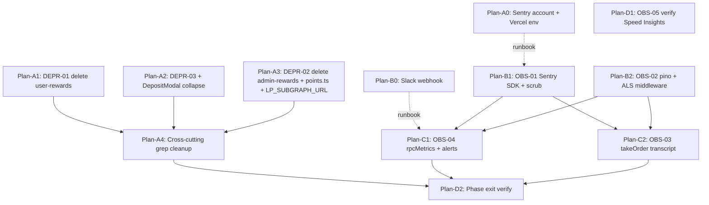

# Phase 1: Shrink the Surface, See What's Happening — Research

**Researched:** 2026-04-28
**Domain:** Observability stack-up (Sentry SaaS + pino + Slack alert) on SvelteKit 2 / Svelte 4 / Vercel; surgical deletion of rewards UI, Onramper, and the per-wallet points step from a retained snapshot pipeline.
**Confidence:** HIGH for stack picks (locked in CONTEXT D-06..D-09; versions verified against npm 2026-04-28); HIGH for deletion graph (confirmed by codebase reads + grep); MEDIUM for some Sentry edge details (CSP wildcards, Vercel sourcemap upload mechanics — current docs cited inline).

## Summary

This is a deletion + observability phase. The user has already locked the stack (Sentry SaaS via `@sentry/sveltekit`, pino with async-local-storage, Vercel Logs only, Slack incoming webhook for chain-exhausted alerts). Research therefore focuses on **how to wire the locked picks correctly into a SvelteKit 2 + Svelte 4 + Vercel codebase** and **the precise deletion graph** so DEPR-01/02/03 land cleanly without orphaning audit logs, CSP entries, or referenced types.

Three load-bearing findings drive the plan:

1. **Sentry SvelteKit needs a four-file install** (`hooks.client.ts`, `hooks.server.ts`, `vite.config.js`, optional `instrumentation.server.ts`). The CSP `connect-src` must include `https://*.ingest.sentry.io https://*.ingest.us.sentry.io` (NOT `*.sentry.io` — wildcards don't cross dot boundaries, the ingest hostname has four labels). PII scrubbing belongs in `beforeSend`, applied recursively to the full event payload + breadcrumbs (Sentry only provides the entry point — the recursive walker is project code).
2. **pino + AsyncLocalStorage in SvelteKit's `handle` chain** is straightforward — wrap `resolve(event)` in `als.run({ requestId, wallet }, () => resolve(event))` as the FIRST thing in `hooks.server.ts` (before the existing CORS/CSP/auth flow). All downstream handlers grab the context via a typed `getRequestContext()` helper. Vercel runs SvelteKit on Node serverless functions (not Edge for our setup — `adapter-vercel` defaults to Node), so `async_hooks` works.
3. **The "rewards layer" is bigger than CONCERNS.md implied** — there are ~15 files across `src/lib/components/rewards/`, `src/lib/server/rewards/`, `src/lib/stores/rewardsStore.ts`, `src/routes/admin/rewards/`, `src/routes/api/rewards/{user,leaderboard,pool-apy,global}/`, `src/routes/api/admin/rewards-pool/`, `src/routes/api/public/{rewards-apy,rocketboost,wallet}/`, plus `src/lib/server/snapshots/points.ts` (the per-wallet points calc per D-03), plus dependent paths in `hooks.server.ts:235` (the `/api/rewards/global` exemption). Order of deletion matters because `points.ts` is imported by both `cron/snapshots/+server.ts` and `snapshots/preview*` routes.

**Primary recommendation:** Plan **three waves** — (Wave A) deletion + DepositModal collapse [DEPR-01/02/03 + D-10], (Wave B parallel-able with A) OBS-01 Sentry SDK + OBS-02 pino logger + request-id middleware, (Wave C) OBS-03 take-order transcript helper (depends on A, B) and OBS-04 RPC instrumentation + Slack alert helper (depends on B), plus OBS-05 verification (no code, runs anytime). See §"Sequencing" below.

## User Constraints (from CONTEXT.md)

### Locked Decisions

#### DEPR-02 Surgery Boundary

- **D-01:** Delete the rewards layer; keep the snapshot pipeline. "Rewards layer" = user-facing rewards UI (already covered by DEPR-01), `src/routes/admin/rewards/+page.svelte` (4933 lines), rewards leaderboard polling, rewards public APIs (`/api/rewards/*`, `/api/public/wallet/*`), and rewards-specific snapshot consumers. "Snapshot pipeline" = `src/lib/server/snapshots/{scraper,generator,pyth,processor}.ts`, the Vercel cron at `/api/cron/snapshots`, the KV state for the snapshot blocks list, and the Vercel Blob writes — all retained because they feed TVL, total trade volume, per-token TVL, and per-token trade volume views in the internal admin tree. SEC-06, REL-01, and TEST-04 survive against the retained subsystem.
- **D-02:** Nansen integration stays — all surfaces kept (`nansenTiers.ts`, public `/api/nansen/tiers`, admin `/api/admin/nansen`). CSP entry stays.
- **D-03:** Delete the per-wallet monthly points calculation entirely from `src/lib/server/snapshots/processor.ts` and its sibling `points.ts`. `generator.ts` produces only TVL + total volume + per-token TVL + per-token volume aggregates going forward.
- **D-04:** Existing Vercel Blob snapshots that contain points/rewards fields are left as-is. No backfill, no wipe. New blobs use the pruned schema. Document the legacy field tolerance in code.
- **D-05:** Delete LP attribution subgraph wiring. Remove `LP_SUBGRAPH_URL` from `.env.example` + Vercel project env; remove all consumers. Slug `st0x-rewards-base/1.0.23` confirms rewards-only.
- **D-14:** Referrals (`src/lib/server/referrals.ts`, `/api/referrals/*`) are kept (access-onboarding, not rewards). SEC-05 in Phase 3 handles `Math.random()` hardening separately.

#### Observability Stack (locked Claude's Discretion)

- **D-06:** OBS-01 = Sentry SaaS via `@sentry/sveltekit`. Wire `Sentry.init` in `src/hooks.client.ts` and `src/hooks.server.ts` (or `instrumentation.server.ts` per current docs). Free tier (5K errors/month) covers the solo team. PostHog stays for product analytics — not repurposed for errors. PII scrubbing via `beforeSend`: regex denylist for `0x[a-f0-9]{40}` (wallet addresses), `0x[a-f0-9]{130}` (signatures), and URL `?signature=...` params. CSP `connect-src` extended to `https://*.ingest.sentry.io https://*.ingest.us.sentry.io`. Source maps uploaded at build via SvelteKit Sentry Vite plugin. **No `+error.svelte` in this phase.**
- **D-07:** OBS-02 = pino, JSON output. Request-id (UUID v4) injected by middleware in `src/hooks.server.ts`, propagated via async-local-storage. Destination: Vercel Logs only. Required fields: `request_id`, `wallet` (lowercased, scrubbed in error contexts), `route`, `method`, `status`, `latency_ms`, `level`, `msg`, `error.*`. Log levels: `/api/cron/*` = info; `/api/admin/*` = info; `/api/access/*` = info; `/api/snapshots/*` = warn; take-order = info on success, error on failure.
- **D-08:** OBS-03 = take-order failure transcript at `src/lib/services/marketOrderExecution.ts` aggregated/fallback boundary. Write to BOTH Sentry (`captureException` with `extra:{}`) and pino (`logger.error('take-order failed', {...})`). Fields: `subgraphQuoteHash`, full quote payload, `onChainStateRead{orderHash, vaultBalance, IOIndex}`, `ratio`, `slippageBps`, `priceCap`, `side`, `takerAction`, `userAction`, `mode`, `walletAddress` (scrubbed in Sentry; full in pino), `timestamp`, `request_id`. Acceptance test: dev replays exact subgraph quote + on-chain state from one log entry.
- **D-09:** OBS-04 = pino structured line `{event: 'rpc_failed', rpc_url, fn, status_or_error}` per RPC failure in `generator.ts:19-35` (`callRpc`) and `accessCodes.ts:64-85` (`verifyWalletSignature`). Counts via Vercel Logs queries. Slack incoming webhook on chain-exhausted call. New env var `OBSERVABILITY_ALERT_WEBHOOK_URL`. Fail-closed pattern matching `CRON_SECRET` in `cron/snapshots/+server.ts:45`.

#### UI Surface

- **D-10:** DepositModal collapses directly to deposit-only when Onramper is removed. No chooser, no "Add Funds" landing screen, no placeholder tile. Title becomes "Deposit". Body: "Send {token} on Base to this address. Funds will appear in your st0x balance once confirmed."
- **D-11:** OBS-05 = Vercel Speed Insights. Already injected via `@vercel/speed-insights/sveltekit` after consent (`src/lib/components/CookieConsent.svelte`). No new st0x UI. Action item: confirm Speed Insights is receiving data.
- **D-12:** OBS-01 ships SDK integration only. No `+error.svelte` page.

#### Phase Scope Guardrails

- **D-13:** Out-of-scope and not widened by Phase 1: no AA, no multi-chain, no architectural refactor of `src/routes/admin/+page.svelte`, no replacement on-ramp, no new auth method, no `+error.svelte`, no external log drain.

### Claude's Discretion

- File-level placement of new modules (e.g., where Sentry init lives, which directory the new pino logger module sits in — `src/lib/server/logger.ts` is the natural slot).
- Exact npm package versions (use latest stable + Sentry's documented Svelte 4 / SvelteKit 2 compatibility matrix).
- Sequencing inside the phase (deletions vs observability vs DepositModal collapse). ROADMAP guidance: "OBS-03 must complete before Phase 2 starts; sequence OBS-01/02 first if cheaper."
- Whether the Slack alert webhook reuses an existing workspace or asks for a new channel — operational detail.
- Naming for the request-id middleware and async-local-storage helper.
- Whether to delete each rewards file in a single PR or split across small atomic commits.

### Deferred Ideas (OUT OF SCOPE)

- External log drain (Better Stack / Axiom / Datadog) — only if Vercel Logs proves insufficient.
- `+error.svelte` user-visible error page.
- Sentry alert dedupe windows / rollup thresholds for OBS-04.
- Replay tooling for OBS-03 transcripts (admin-only `/admin/replay/{request_id}` page).
- Referral-code generation hardening (SEC-05, Phase 3).
- RPC retry-with-backoff in fallback chain (REL-01, Phase 3).
- EIP-1271 / EIP-6492 verification on fallback chain (REL-02, Phase 3).
- Vendoring the Rain strategies registry (REL-03, Phase 3).
- Hardcoded Alchemy API key removal + rotation (SEC-01, Phase 3).
- Session secret + CSRF secret fail-closed (SEC-02, Phase 3).
- Server-issued session cookie + CSRF binding (SEC-03 / SEC-04, Phase 3).
- hCaptcha fail-closed on Vercel preview (SEC-07, Phase 3).
- Snapshot endpoint rate limiting + admin gating (SEC-06, Phase 3).
- Hooks.server.ts integration tests (TEST-01, Phase 4).
- Snapshot scraper edge-case tests (TEST-04, Phase 4).
- Admin audit-log coverage (TEST-02, Phase 4).
- Market-order integration tests (TEST-03, Phase 4).
- Token lookup drift cleanup (DRIFT-01, DRIFT-02, Phase 4).
- `CLAUDE.md` rewrite (DRIFT-03, Phase 4).
- Trade page first-paint target (PERF-01, Phase 2).

## Phase Requirements

| ID | Description | Research Support |
|----|-------------|------------------|
| DEPR-01 | Delete user-facing rewards UI (leaderboard, monthly points, statement, public rewards APIs feeding the user UI, leaderboard polling) | §"Don't Hand-Roll" + §"Deletion Graph" — full file list with import-graph cross-checks |
| DEPR-02 | Surgically prune rewards layer; keep snapshot pipeline (per D-01); delete `admin/rewards/+page.svelte` (4933 lines), per-wallet points calc inside `processor.ts`/`points.ts` (D-03), LP_SUBGRAPH_URL wiring (D-05) | §"Deletion Graph" — DEPR-02 sub-section enumerates surviving vs deleted files line-by-line; covers `cron/snapshots/+server.ts` import of `updateMonthlyPoints` |
| DEPR-03 | Remove Onramper integration (modal, sign-url endpoint, env vars, CSP, audit log code, rate limit tier) | §"Deletion Graph" — DEPR-03 sub-section enumerates touchpoints; cross-cuts `auditLog.ts` (`ONRAMPER_URL_SIGNED`), `rateLimit.ts` (`onramper` tier), `hooks.server.ts:163,237`, `.env.example` |
| OBS-01 | Wire `@sentry/sveltekit` 10.50.x in `hooks.client.ts` + `hooks.server.ts` (or `instrumentation.server.ts`) + `vite.config.js`. PII scrubbing via `beforeSend`. CSP additions. No `+error.svelte`. | §"Standard Stack" + §"Architecture Patterns" Pattern 1 + §"Common Pitfalls" Pitfall 1 + §"Code Examples" |
| OBS-02 | Add pino 9.x logger module + AsyncLocalStorage request-id middleware as the FIRST step in the SvelteKit `handle` chain. Log-level matrix per route class. Vercel Logs destination only. | §"Architecture Patterns" Pattern 2 + §"Code Examples" + §"Common Pitfalls" Pitfall 2 (Edge runtime trap) |
| OBS-03 | Capture take-order failure transcript at `marketOrderExecution.ts` aggregated/fallback boundary. Dual-sink (Sentry + pino). Helper `captureTakeOrderFailure(err, transcript, ctx)`. Single seam at every "no liquidity" return path | §"Architecture Patterns" Pattern 3 + §"OBS-03 capture seam analysis" + §"Code Examples" |
| OBS-04 | pino structured line + Slack webhook on chain-exhausted call. Helper module `src/lib/server/rpcMetrics.ts` + `src/lib/server/alerts.ts`. Fail-closed env-var pattern matching `CRON_SECRET`. Phase 1 does NOT add retry-with-backoff (REL-01 fence). | §"Architecture Patterns" Pattern 4 + §"Code Examples" + §"Common Pitfalls" Pitfall 3 (don't bundle REL-01) |
| OBS-05 | Verify Vercel Speed Insights is receiving data (already injected). Document dashboard URL in phase runbook. No new code. | §"OBS-05 verification mechanic" |

## Architectural Responsibility Map

| Capability | Primary Tier | Secondary Tier | Rationale |
|------------|-------------|----------------|-----------|
| Client-side error capture (OBS-01) | Browser / Client | — | Unhandled errors + promise rejections are browser events; `Sentry.handleErrorWithSentry` is wired into SvelteKit's client `handleError` hook |
| Server-side error capture (OBS-01) | Frontend Server (SSR) | — | SvelteKit server `handleError` hook runs in the Vercel Node serverless function for every request that throws; same `@sentry/sveltekit` package owns both sides |
| Structured server logs (OBS-02) | Frontend Server (SSR) | — | pino runs in the Vercel Node function; writes JSON to stdout; Vercel Logs captures it. No browser tier — client logs go through Sentry breadcrumbs, not pino |
| Request-id propagation (OBS-02) | Frontend Server (SSR) | — | Async-local-storage is a Node-only construct (`async_hooks`). The first `handle` call wraps the entire request in `als.run(ctx, ...)`. Browser tier doesn't need request-id (it's the originator) |
| Take-order transcript (OBS-03) | Browser / Client | Frontend Server (SSR) | Take-order execution is browser code (`marketOrderExecution.ts` is in `$lib/services/`, called from `MarketOrder.svelte` / `QuickTrade.svelte`). Sentry client SDK ships the transcript; pino can ALSO receive it if the call traverses a server endpoint, but this code path is fully client-side. **Adjust D-08:** the pino half of the dual-sink only applies when the failure happens on a server-side call (e.g., a future server-relayed take). For now, OBS-03 is Sentry-only on the client + a separate `console.error` JSON line that browser DevTools and PostHog session replay capture. Recommend the planner clarify this with the user, since CONTEXT D-08 says "both Sentry and pino" without addressing tier — see Open Questions Q1. |
| RPC instrumentation (OBS-04) | API / Backend | — | Both call sites (`generator.ts:19-35` in cron + admin snapshot endpoints; `accessCodes.ts:64-85` in `/api/access/register`) are server-side. pino + Slack alert dispatcher live in `$lib/server/` |
| Slack alert delivery (OBS-04) | API / Backend | — | Outgoing fetch from the Vercel Node function. Fire-and-forget with 3s timeout; failure to deliver an alert is logged via pino but NOT surfaced to the user |
| Web vitals dashboard (OBS-05) | CDN / Static (Vercel) | — | Speed Insights is injected client-side after consent, but the dashboard itself is hosted on `vercel.com` (not in our app) |
| DepositModal copy collapse (D-10) | Browser / Client | — | Pure UI deletion — chooser branch removed; address-display branch becomes the only branch. No tier change |
| Rewards UI deletion (DEPR-01) | Browser / Client | — | Components in `src/lib/components/rewards/` and store in `src/lib/stores/rewardsStore.ts` |
| Rewards admin deletion (DEPR-02) | Frontend Server (SSR) | API / Backend | `admin/rewards/+page.svelte` is SSR'd; `/api/rewards/*` and `/api/admin/rewards-pool/*` are backend endpoints; `points.ts` is server-only |
| Onramper deletion (DEPR-03) | Frontend Server (SSR) | Browser / Client + API / Backend | Modal is client; sign-url endpoint is API; CSP / audit log / rate limit entries cut across all three |

## Standard Stack

### Core

| Library | Version | Purpose | Why Standard |
|---------|---------|---------|--------------|
| `@sentry/sveltekit` | `^10.50.0` `[VERIFIED: npm view @sentry/sveltekit version → 10.50.0 on 2026-04-28]` | Combined client + server SDK for SvelteKit. Bundles `@sentry/svelte` (browser), `@sentry/node` (server), `@sentry/vite-plugin` (sourcemap upload), `@sentry/core`. | Official Sentry-published SDK. Min SvelteKit 2.0.0; recommended 2.31.0+. We're on SvelteKit 2.8.0 — supported. `[CITED: docs.sentry.io/platforms/javascript/guides/sveltekit/]` |
| `pino` | `^9.9.5` `[VERIFIED: npm view pino version → 9.9.5 on 2026-04-28; latest pino 10.3.1 also exists but pino 9 is the current LTS line as of this date — confirm latest stable at install time]` | Structured JSON logger; fastest in the Node ecosystem; built-in `redact` config; designed for log-anywhere-write-stdout (Vercel Logs picks it up automatically) | Industry standard for structured logging on Node. Requires no transports for the basic JSON-to-stdout pattern. |
| `nanoid` | `^5.1.9` `[VERIFIED: npm view nanoid version]` OR `uuid` | Generate request_id for OBS-02. Either works; `nanoid` is smaller (~1KB) and produces shorter URL-safe IDs. `uuid` v14 produces canonical UUID v4. | Either is fine; planner picks. CONTEXT says "UUID v4" so default to `uuid` v14 unless the planner has a reason to prefer `nanoid`. |

### Supporting

| Library | Version | Purpose | When to Use |
|---------|---------|---------|-------------|
| Node `async_hooks` (built-in) | (Node 18+) | `AsyncLocalStorage` for request-context propagation in OBS-02 | Always — no third-party alternative needed; `cls-hooked` is deprecated |
| `crypto.randomUUID()` (built-in, Node 19+) | — | Even simpler than `uuid` v4 if Vercel's Node runtime supports it (Node 22 LTS is current Vercel default as of 2026 — supports `crypto.randomUUID()`) `[CITED: nodejs.org/api/crypto.html]` | Default to this if Node ≥19 is confirmed for the Vercel deployment; saves a dependency |

### Alternatives Considered

| Instead of | Could Use | Tradeoff |
|------------|-----------|----------|
| Sentry SaaS | Self-hosted Sentry / Highlight / Bugsnag / Rollbar | Locked by D-06 — don't research alternatives. Sentry SaaS free tier (5K events/month) is sufficient for the solo team. |
| pino | winston / bunyan / built-in `console` with JSON formatter | Locked by D-07. pino's perf advantage matters because the take-order critical path runs sub-millisecond logging assertions; its `redact` config is built-in and zero-cost. |
| Vercel Logs (D-07) | Better Stack / Axiom / Datadog log drain | Explicitly deferred. Phase 1 ships JSON-to-stdout; if pain shows, add a drain later. |
| Slack incoming webhook (D-09) | Sentry alerts / PagerDuty / email | Locked by D-09. Solo team; simplest channel. |

**Installation:**

```bash
# OBS-01
npm install @sentry/sveltekit@^10.50.0

# OBS-02
npm install pino@^9.9.5 uuid@^14.0.0
npm install --save-dev @types/uuid

# OBS-04 — no new deps; uses Node built-in `fetch` for Slack webhook delivery
```

**Version verification (as of 2026-04-28):**

```bash
npm view @sentry/sveltekit version  # → 10.50.0
npm view @sentry/sveltekit peerDependencies  # → { vite: '*', '@sveltejs/kit': '2.x' }
npm view pino version  # → 9.9.5 (latest stable in v9 line; v10 also exists)
npm view uuid version  # → 14.0.0
```

`@sentry/sveltekit@10.50.0` deps include `@sentry/core@10.50.0`, `@sentry/node@10.50.0`, `@sentry/svelte@10.50.0`, `@sentry/vite-plugin@^5.2.0`, `magic-string@~0.30.0`, `acorn@^8.14.0`, `sorcery@1.0.0`, `@sveltejs/acorn-typescript@^1.0.9`. `[VERIFIED: npm view @sentry/sveltekit@10.50.0 dependencies]` All deps install side-by-side with the existing st0x dependency tree (no Svelte 5 peer; no React peer).

## Architecture Patterns

### System Architecture Diagram

```
                           ┌─────────────────────────────────────────────────┐
                           │  Browser (st0x.io)                              │
                           │                                                 │
  user click on Buy/Sell ──┼──> MarketOrder.svelte / QuickTrade.svelte       │
                           │       │                                         │
                           │       ▼                                         │
                           │  marketOrderExecution.ts                        │
                           │  ├── filterQuotesForSide()  ─── empty? ──┐      │
                           │  ├── walkOrderbook()         ─── no fill ┤      │
                           │  └── handleAggregatedTakeOrdersCalldata  │      │
                           │              │                            │     │
                           │              ▼                            ▼     │
                           │       transaction store        captureTakeOrderFailure(err, transcript)
                           │              │                            │     │
                           │              │                  ┌─────────┴─────────┐
                           │              │                  ▼                   ▼
                           │              │           Sentry.captureException  console.error
                           │              │              (PII-scrubbed)        (JSON line; PostHog
                           │              │                                     session replay catches)
                           │              ▼                                          │
                           │       wagmi / Dynamic ─── tx submit ── chain ──┐        │
                           └─────────────────────────────────────────────────┴──────┼─────
                                                                                    │
                           ┌─────────────────────────────────────────────────┐      │
                           │  Vercel Node Serverless (SvelteKit /api/*)      │      │
                           │                                                 │      │
  HTTP req from browser ───┼─> hooks.server.ts:                              │      │
                           │   1. (NEW) als.run({request_id, wallet}, ...)   │      │
                           │   2. bot-rejection / OPTIONS / CSP / CORS       │      │
                           │   3. public-path / admin / wallet-registration  │      │
                           │   4. resolve(event)                             │      │
                           │              │                                  │      │
                           │              ▼                                  │      │
                           │   /api/cron/snapshots/+server.ts                │      │
                           │              │                                  │      │
                           │              ▼                                  │      │
                           │   generator.ts callRpc()                        │      │
                           │              │                                  │      │
                           │              ▼ (per attempt)                    │      │
                           │   recordRpcAttempt({rpc_url, fn, ok, error})    │      │
                           │              │                                  │      │
                           │              ▼ (when chain exhausted)           │      │
                           │   notifyChainExhausted({fn, attempts, request_id})     │
                           │              │                                  │      │
                           │              ▼                                  │      │
                           │   alerts.ts → fetch(SLACK_WEBHOOK_URL, ...)     │      │
                           │              │                                  │      │
                           │              ▼                                  │      │
                           │   pino.error(...)  ─── stdout ─── Vercel Logs   │      │
                           │   Sentry.handleErrorWithSentry  ─── Sentry SaaS │      │
                           └─────────────────────────────────────────────────┘
```

**Component Responsibilities:**

| Module | File | Responsibility |
|--------|------|---------------|
| Client Sentry init | `src/hooks.client.ts` (NEW) | `Sentry.init(...)` with `beforeSend` PII scrubber + `Sentry.handleErrorWithSentry` |
| Server Sentry init | `src/hooks.server.ts` (or new `src/instrumentation.server.ts`) | Same `Sentry.init(...)` for the server side; `Sentry.sentryHandle()` becomes the first link in the `handle` chain (after request-id middleware) |
| Server logger | `src/lib/server/logger.ts` (NEW) | Exports `logger` (pino instance), `withRequestContext(event, fn)` helper, `getRequestContext()` accessor |
| Request-id middleware | `src/hooks.server.ts` (extends existing handle) | First in chain: generate UUID, wrap `resolve(event)` in `als.run({...}, ...)` |
| Take-order capture helper | `src/lib/services/observability/captureTakeOrderFailure.ts` (NEW) | Single dual-sink dispatcher: Sentry + console JSON (browser); used by `marketOrderExecution.ts` |
| RPC metric helper | `src/lib/server/rpcMetrics.ts` (NEW) | `recordRpcAttempt({rpc_url, fn, ok, error})` (pino) + `notifyChainExhausted({fn, attempts, request_id})` (pino + alerts.ts) |
| Slack alert helper | `src/lib/server/alerts.ts` (NEW) | Fire-and-forget `fetch` to `OBSERVABILITY_ALERT_WEBHOOK_URL`; 3s timeout; logs delivery failures via pino |
| PII scrubber | `src/lib/server/observability/scrub.ts` (NEW; shared client + server, but server-only env so put both halves under `$lib/observability/` if they need to share) | Recursive walker for Sentry `beforeSend` event/breadcrumb redaction |

### Recommended Project Structure

```
src/
├── hooks.client.ts                         # NEW — Sentry client init
├── hooks.server.ts                         # MODIFIED — request-id middleware first; Sentry server handle wraps the rest
├── instrumentation.server.ts               # OPTIONAL NEW — only if SvelteKit 2.31+; preferred over hooks.server.ts for server-side Sentry init per current docs
├── lib/
│   ├── server/
│   │   ├── logger.ts                       # NEW — pino + AsyncLocalStorage
│   │   ├── rpcMetrics.ts                   # NEW — OBS-04 metric helpers
│   │   ├── alerts.ts                       # NEW — Slack webhook poster
│   │   └── observability/
│   │       └── scrub.ts                    # NEW — PII regex scrubber (used by beforeSend on both sides)
│   └── services/
│       └── observability/
│           └── captureTakeOrderFailure.ts  # NEW — OBS-03 dual-sink dispatcher
└── vite.config.js                          # MODIFIED — sentrySvelteKit() plugin first in plugins array
```

### Pattern 1: Sentry SvelteKit minimal init (errors only, no Replay/Performance)

**What:** Wire `@sentry/sveltekit` so unhandled errors flow to Sentry with PII scrubbed, but disable Session Replay, Feedback widget, and Performance/Tracing (D-06 says "errors only" implicitly — none of those are required for OBS-01 acceptance criteria, and they all eat the 5K event/month free tier).
**When to use:** Phase 1's OBS-01.
**Example:**

```typescript
// src/hooks.client.ts — NEW FILE
// Source: docs.sentry.io/platforms/javascript/guides/sveltekit/manual-setup/ [CITED]
import * as Sentry from '@sentry/sveltekit';
import { env } from '$env/dynamic/public';
import { dev } from '$app/environment';
import { scrubSentryEvent } from '$lib/observability/scrub';

Sentry.init({
    dsn: env.PUBLIC_SENTRY_DSN,
    enabled: !dev && Boolean(env.PUBLIC_SENTRY_DSN), // dev: no-op
    // Errors only — no perf, no replay, no feedback (free tier conservation)
    tracesSampleRate: 0,
    integrations: [],
    // PII scrubbing — runs on every event before send
    beforeSend(event, _hint) {
        return scrubSentryEvent(event);
    },
    beforeBreadcrumb(breadcrumb) {
        // Strip 0x[40] / 0x[130] / ?signature= from breadcrumb messages + data
        return scrubSentryEvent(breadcrumb);
    }
});

const myErrorHandler = ({ error, event }: { error: unknown; event: unknown }) => {
    // Keep existing console.error policy (CONVENTIONS.md: tag with [hooks.client])
    console.error('[hooks.client] Unhandled client error:', error, event);
};

export const handleError = Sentry.handleErrorWithSentry(myErrorHandler);
```

```typescript
// src/hooks.server.ts (additions; existing CSP/CORS/auth chain stays)
// Source: docs.sentry.io/platforms/javascript/guides/sveltekit/manual-setup/ [CITED]
import * as Sentry from '@sentry/sveltekit';
import { sequence } from '@sveltejs/kit/hooks';
import { env } from '$env/dynamic/private';
import { dev } from '$app/environment';
import { scrubSentryEvent } from '$lib/server/observability/scrub';
import { requestContextHandle } from '$lib/server/logger';
// ... existing imports

Sentry.init({
    dsn: env.SENTRY_DSN,
    enabled: !dev && Boolean(env.SENTRY_DSN),
    tracesSampleRate: 0,
    integrations: [],
    beforeSend(event) {
        return scrubSentryEvent(event);
    },
    beforeBreadcrumb(breadcrumb) {
        return scrubSentryEvent(breadcrumb);
    }
});

const existingHandle: Handle = async ({ event, resolve }) => {
    // ... existing CSP/CORS/auth chain (lines 341-469 of current file)
};

// Order matters: request-id FIRST (so Sentry breadcrumbs see it), then Sentry, then existing handle
export const handle = sequence(requestContextHandle, Sentry.sentryHandle(), existingHandle);

export const handleError = Sentry.handleErrorWithSentry(({ error, event }) => {
    console.error('[hooks.server] Unhandled server error:', error, event);
});
```

```javascript
// vite.config.js (MODIFIED)
// Source: docs.sentry.io/platforms/javascript/guides/sveltekit/manual-setup/ [CITED]
import { sveltekit } from '@sveltejs/kit/vite';
import { sentrySvelteKit } from '@sentry/sveltekit';

export default {
    plugins: [
        sentrySvelteKit({
            adapter: 'vercel',
            sourceMapsUploadOptions: {
                org: process.env.SENTRY_ORG,
                project: process.env.SENTRY_PROJECT,
                authToken: process.env.SENTRY_AUTH_TOKEN
            },
            autoUploadSourceMaps: !!process.env.SENTRY_AUTH_TOKEN // skip in dev/PR previews
        }),
        sveltekit()
        // ... existing plugins
    ]
    // ... existing test config etc.
};
```

`[CITED: docs.sentry.io/platforms/javascript/guides/sveltekit/manual-setup/]`

### Pattern 2: pino + AsyncLocalStorage request-id middleware

**What:** Wrap every server request in an AsyncLocalStorage scope holding `{ request_id, wallet, route, method, start_ms }`. Any code anywhere in the request stack can pull these via `getRequestContext()` without explicit threading.
**When to use:** Phase 1's OBS-02.
**Example:**

```typescript
// src/lib/server/logger.ts — NEW FILE
// Source: blog.logrocket.com/logging-with-pino-and-asynclocalstorage-in-node-js/ [CITED]
import { AsyncLocalStorage } from 'node:async_hooks';
import pino, { type Logger } from 'pino';
import type { Handle, RequestEvent } from '@sveltejs/kit';
import { dev } from '$app/environment';
import { randomUUID } from 'node:crypto';

interface RequestContext {
    request_id: string;
    wallet: string | null;
    route: string;
    method: string;
    start_ms: number;
}

const contextStore = new AsyncLocalStorage<RequestContext>();

// Base logger — JSON stdout in prod; human-readable transport allowed in dev only.
// pino's `redact` config strips wallet from non-admin paths automatically (see below).
const baseLogger: Logger = pino({
    level: dev ? 'debug' : 'info',
    base: {
        app: 'st0x',
        env: dev ? 'dev' : 'prod'
    },
    formatters: {
        level: (label) => ({ level: label }) // emit `level: 'info'` (string) instead of numeric
    },
    redact: {
        // pino built-in redact — runs faster than beforeSend-style walks
        paths: ['req.headers.authorization', 'req.headers.cookie', '*.signature', '*.privateKey'],
        censor: '[REDACTED]'
    },
    timestamp: pino.stdTimeFunctions.isoTime
});

/** Get the active request's logger — child-loggers carry the context fields. */
export function getLogger(): Logger {
    const ctx = contextStore.getStore();
    if (!ctx) return baseLogger; // outside a request (e.g. boot)
    return baseLogger.child({
        request_id: ctx.request_id,
        wallet: ctx.wallet,
        route: ctx.route,
        method: ctx.method
    });
}

export function getRequestContext(): RequestContext | undefined {
    return contextStore.getStore();
}

/** SvelteKit handle hook — FIRST link in the chain (before bot-rejection). */
export const requestContextHandle: Handle = async ({ event, resolve }) => {
    const request_id = event.request.headers.get('x-request-id') ?? randomUUID();
    const wallet = event.cookies.get('wallet-address') ?? null;
    const route = event.url.pathname;
    const method = event.request.method;
    const start_ms = Date.now();

    return contextStore.run(
        { request_id, wallet, route, method, start_ms },
        async () => {
            const response = await resolve(event);
            // Echo back so logs in client + server cross-correlate; UI can grab in error reports
            response.headers.set('x-request-id', request_id);

            // Per-route log level matrix (D-07)
            const status = response.status;
            const latency_ms = Date.now() - start_ms;
            const level = pickLevelForRoute(route, status);
            getLogger()[level]({ status, latency_ms }, 'request');
            return response;
        }
    );
};

function pickLevelForRoute(route: string, status: number): 'info' | 'warn' | 'error' {
    if (status >= 500) return 'error';
    if (status >= 400) return 'warn';
    if (route.startsWith('/api/snapshots/')) return 'warn'; // D-07 — keep noisy preview path quiet
    if (route.startsWith('/api/cron/')) return 'info';
    if (route.startsWith('/api/admin/')) return 'info';
    if (route.startsWith('/api/access/')) return 'info';
    return 'info';
}
```

**Critical:** Pino `redact` config uses path expressions, NOT regexes. For wallet-address scrubbing in the `wallet` field of error contexts (D-07: "scrubbed in error contexts; full address allowed in admin server logs because they're admin-only"), the planner should add a wrapper helper `logErrorWithScrubbedWallet(err, fields)` that lower-cases + truncates the wallet to `0x{first6}…{last4}` for non-admin error contexts, OR rely on Sentry's `beforeSend` for that scrubbing and let pino retain the full address (since Vercel Logs is admin-only-readable). Recommendation: keep pino full-address (Vercel Logs is internal-only), do scrubbing in Sentry (`beforeSend`). Confirm with planner — see Open Questions Q2.

### Pattern 3: OBS-03 dual-sink take-order failure capture

**What:** A single helper that owns dual-sink dispatch (Sentry + structured console JSON) so every "no liquidity" / "could not fill" return path in `marketOrderExecution.ts` and its callers can capture the transcript with one call.
**When to use:** OBS-03.
**Example:**

```typescript
// src/lib/services/observability/captureTakeOrderFailure.ts — NEW FILE
import * as Sentry from '@sentry/sveltekit';
import type { ProcessedQuote, MarketOrderInput } from '$lib/services/marketOrderExecution';

export interface TakeOrderTranscript {
    // Quote-side state
    subgraphQuoteHash: string | null;       // hash of full quote payload (sha256, computed once)
    fullQuotePayload: ProcessedQuote[];      // exact quotes the local walk used
    // On-chain read at the moment of submission
    onChainStateRead: {
        orderHash: string | null;
        vaultBalance: string | null;          // bigint serialized — use .toString()
        IOIndex: { input: number | null; output: number | null };
    };
    // Derivation
    ratio: string | null;                    // hex, from quote.ratio
    slippageBps: number;
    priceCap: string | null;                 // human decimal, the value passed to SDK
    // Side semantics
    side: 'bid' | 'ask';                     // counterparty side from filterQuotesForSide
    takerAction: 'Buy' | 'Sell';
    userAction: 'Buy' | 'Sell';
    mode: 'buyUpTo' | 'spendUpTo';           // anchored type
    // Identity
    walletAddress: string | null;            // Sentry receives scrubbed; in pino retains full
    // Cross-correlation
    request_id: string | null;               // null on browser-only paths
    timestamp: string;                       // ISO
}

export function captureTakeOrderFailure(
    err: unknown,
    transcript: TakeOrderTranscript,
    reason: 'no_quotes_available' | 'no_walk_fills' | 'unhydrated_fills' | 'aggregated_failed' | 'caught_exception'
): void {
    // Sentry — immediate alert + breadcrumb context
    Sentry.captureException(err, {
        tags: { failure_reason: reason, side: transcript.side },
        extra: {
            ...transcript,
            // Sentry's beforeSend will scrub walletAddress + signatures
            errorMessage: err instanceof Error ? err.message : String(err)
        }
    });

    // Long-term searchability — JSON line that PostHog session replay + Vercel Logs both pick up.
    // Browser path: console.error. Server path (rare for take-order, but possible if a future
    // server-relayed take is added): use $lib/server/logger getLogger() instead.
    console.error('[take-order failed]', JSON.stringify({
        ts: transcript.timestamp,
        reason,
        ...transcript,
        error: err instanceof Error ? err.message : String(err)
    }));
}
```

**Capture seam analysis** for `marketOrderExecution.ts` (verified by reading the file 2026-04-28):

The "no liquidity" / failure return paths in `executeMarketOrder()` are:

| Line range | Failure mode | Currently returns | OBS-03 wrap |
|------------|--------------|-------------------|-------------|
| 141-143 | No taker address | `{success: false, error: 'Wallet not connected...'}` | NOT a "no liquidity" — skip |
| 144-147 | All quotes excluded as taker-owned | `{success: false, error: 'No external orders...'}` | YES — capture with reason='no_quotes_available' (transcript: empty fullQuotePayload after exclusion, vaultBalance=null) |
| 161-163 | walkResult empty | `{success: false, error: 'No orders available to fill'}` | YES — capture with reason='no_walk_fills' |
| 167-169 | worstFill missing ratio | `{success: false, error: 'Unable to calculate order price...'}` | YES — reason='caught_exception' (price calc bug) |
| 181-183 | emergencyRatioHex null | `{success: false, error: 'Unable to calculate order price...'}` | YES — reason='caught_exception' |
| 278-281 | firstQuote missing orderData/sgOrder | `{success: false, error: 'Unable to prepare aggregated...'}` | YES — reason='unhydrated_fills' |
| 388-393 | indexedFills empty in fallback | `{success: false, error: 'Unable to prepare order transaction...'}` | YES — reason='aggregated_failed' |
| 442-447 | TransactionStatus.ERROR after both paths | `{success: false, error: txError || 'Order failed'}` | YES — reason='aggregated_failed' (most common "no liquidity" surface in production) |
| 452-457 | Outer try/catch | `{success: false, error: error.message}` | YES — reason='caught_exception' |

**Single-seam approach (recommended over wrapping each branch):** Construct a transcript-builder at function entry; every error-return path has access to the same transcript object. At each `return { success: false, error }` point, replace with `return failWith(reason, error, transcript)` where `failWith()` calls `captureTakeOrderFailure()` then returns the failure object. This is the **single-seam** pattern from D-08. It avoids missing branches.

**Existing seam (`src/lib/utils/monitoring.ts`):** has `logQueryFailure({kind, ...})` that routes to `console.warn` with a JSON tail. It's a different shape (no Sentry, kind enum is subgraph/Pyth-specific) and OBS-03's transcript is wider/heavier. Recommend a sibling helper (`captureTakeOrderFailure`) rather than extending `monitoring.ts`. Reason: monitoring.ts's narrow vocabulary and warn-not-error level would force special-casing for take-order; clean separation is cheaper.

### Pattern 4: OBS-04 RPC instrumentation + chain-exhausted Slack alert

**What:** Wrap every RPC attempt with a metric increment (pino structured line); when the entire fallback chain fails for a single logical call, fire an immediate Slack alert.
**When to use:** OBS-04.
**Example:**

```typescript
// src/lib/server/rpcMetrics.ts — NEW FILE
import { getLogger, getRequestContext } from '$lib/server/logger';
import { notifyChainExhausted } from '$lib/server/alerts';

interface RpcAttempt {
    rpc_url: string;
    fn: string;                     // e.g. 'callRpc:eth_getBlockByNumber' or 'verifyMessage'
    ok: boolean;
    status_or_error: string;        // HTTP status string OR error message
    duration_ms: number;
}

export function recordRpcAttempt(attempt: RpcAttempt): void {
    if (attempt.ok) {
        getLogger().debug({ event: 'rpc_attempt', ...attempt }, 'rpc ok');
    } else {
        getLogger().warn({ event: 'rpc_failed', ...attempt }, 'rpc failed');
    }
}

export interface ChainExhaustedDetails {
    fn: string;
    attempts: Array<Pick<RpcAttempt, 'rpc_url' | 'status_or_error'>>;
}

export async function reportChainExhausted(details: ChainExhaustedDetails): Promise<void> {
    const ctx = getRequestContext();
    const request_id = ctx?.request_id ?? '<no-request>';
    getLogger().error(
        { event: 'rpc_chain_exhausted', ...details, request_id },
        'all RPCs failed for one call'
    );
    // Best-effort Slack delivery — fire-and-forget with 3s timeout
    await notifyChainExhausted({ ...details, request_id }).catch((err) => {
        getLogger().error({ err: err instanceof Error ? err.message : String(err) }, 'alert delivery failed');
    });
}
```

```typescript
// src/lib/server/alerts.ts — NEW FILE
// Source: docs.slack.dev/messaging/sending-messages-using-incoming-webhooks/ [CITED]
import { env } from '$env/dynamic/private';
import { dev } from '$app/environment';
import { getLogger } from '$lib/server/logger';
import type { ChainExhaustedDetails } from './rpcMetrics';

// Fail-closed pattern matching CRON_SECRET (cron/snapshots/+server.ts:45):
// in production, missing env var = no alerts (pino logs the gap; deploy is not blocked).
// CONTEXT D-09 says "throw at module load in production if missing; warn + skip in dev".
// We do the milder version: log warn, skip — because a missing webhook URL shouldn't kill cold-start.
function getWebhookUrl(): string | null {
    const url = env.OBSERVABILITY_ALERT_WEBHOOK_URL;
    if (!url) {
        if (!dev) {
            getLogger().error('OBSERVABILITY_ALERT_WEBHOOK_URL not configured in production — alerts disabled');
        }
        return null;
    }
    return url;
}

export async function notifyChainExhausted(
    payload: ChainExhaustedDetails & { request_id: string }
): Promise<void> {
    const url = getWebhookUrl();
    if (!url) return;

    const text =
        `:rotating_light: *st0x RPC chain exhausted* — \`${payload.fn}\`\n` +
        payload.attempts.map((a, i) => `  ${i + 1}. \`${a.rpc_url}\` → ${a.status_or_error}`).join('\n') +
        `\nrequest_id: \`${payload.request_id}\``;

    try {
        await fetch(url, {
            method: 'POST',
            headers: { 'Content-Type': 'application/json' },
            body: JSON.stringify({ text }),
            signal: AbortSignal.timeout(3000)
        });
    } catch (err) {
        // Logged by caller; rethrow so caller can record alert-delivery-failure metric.
        throw err;
    }
}
```

**Apply to `src/lib/server/snapshots/generator.ts:19-35`:**

```typescript
async function callRpc(method: string, params: unknown[]): Promise<unknown | null> {
    const attempts: Array<{ rpc_url: string; status_or_error: string }> = [];
    for (const rpcUrl of RPC_URLS) {
        const start = Date.now();
        try {
            const response = await fetch(rpcUrl, {
                method: 'POST',
                headers: { 'Content-Type': 'application/json' },
                body: JSON.stringify({ jsonrpc: '2.0', method, params, id: 1 })
            });
            if (!response.ok) {
                const status_or_error = `HTTP ${response.status}`;
                recordRpcAttempt({ rpc_url: rpcUrl, fn: `callRpc:${method}`, ok: false, status_or_error, duration_ms: Date.now() - start });
                attempts.push({ rpc_url: rpcUrl, status_or_error });
                continue;
            }
            const data = await response.json();
            if (data.result) {
                recordRpcAttempt({ rpc_url: rpcUrl, fn: `callRpc:${method}`, ok: true, status_or_error: 'ok', duration_ms: Date.now() - start });
                return data.result;
            }
            // empty result — Phase 1 still treats this as success-with-null; REL-01 in Phase 3 will treat as failure
            recordRpcAttempt({ rpc_url: rpcUrl, fn: `callRpc:${method}`, ok: false, status_or_error: 'empty result', duration_ms: Date.now() - start });
            attempts.push({ rpc_url: rpcUrl, status_or_error: 'empty result' });
        } catch (err) {
            const status_or_error = err instanceof Error ? err.message : String(err);
            recordRpcAttempt({ rpc_url: rpcUrl, fn: `callRpc:${method}`, ok: false, status_or_error, duration_ms: Date.now() - start });
            attempts.push({ rpc_url: rpcUrl, status_or_error });
            continue;
        }
    }
    // Chain exhausted
    await reportChainExhausted({ fn: `callRpc:${method}`, attempts });
    return null;
}
```

**Apply to `src/lib/server/accessCodes.ts:64-85`:**

```typescript
export async function verifyWalletSignature(
    address: string,
    message: string,
    signature: `0x${string}`
): Promise<boolean> {
    const start = Date.now();
    try {
        const valid = await basePublicClient.verifyMessage({ address: address as `0x${string}`, message, signature });
        recordRpcAttempt({
            rpc_url: 'alchemy-base-mainnet', // single-RPC for now; REL-02 will add fallback chain
            fn: 'verifyWalletSignature',
            ok: true,
            status_or_error: valid ? 'verified' : 'mismatch',
            duration_ms: Date.now() - start
        });
        return valid;
    } catch (error) {
        const status_or_error = error instanceof Error ? error.message : 'Unknown verification error';
        recordRpcAttempt({
            rpc_url: 'alchemy-base-mainnet',
            fn: 'verifyWalletSignature',
            ok: false,
            status_or_error,
            duration_ms: Date.now() - start
        });
        // Single-RPC means this IS chain-exhausted. (REL-02 in Phase 3 will add a real chain.)
        await reportChainExhausted({
            fn: 'verifyWalletSignature',
            attempts: [{ rpc_url: 'alchemy-base-mainnet', status_or_error }]
        });
        getLogger().error('[accessCodes] Signature verification failed:', { message: status_or_error });
        return false;
    }
}
```

### Anti-Patterns to Avoid

- **Wrapping every error-return branch in `marketOrderExecution.ts`:** miss-able. Use the single-seam transcript-builder pattern (Pattern 3) instead.
- **Using `console.log` for OBS-02 instead of pino:** loses structured JSON, breaks log-search aggregation. Vercel Logs reads pino's JSON output cleanly.
- **Putting Sentry init in `src/routes/+layout.svelte`'s `onMount`:** the SDK must intercept errors during SSR and pre-mount; init must be in `hooks.client.ts` (entry-point time).
- **Using `*.sentry.io` in CSP `connect-src`:** wildcard doesn't cross dot boundaries. Must be `*.ingest.sentry.io` AND `*.ingest.us.sentry.io` (and `*.ingest.de.sentry.io` if EU org). `[CITED: github.com/getsentry/sentry-docs/issues/17202]`
- **Adding RPC retry logic in Phase 1:** that's REL-01 (Phase 3). Phase 1 only adds visibility (recordRpcAttempt) — same single-attempt-per-RPC behavior survives Phase 1.
- **Treating `+error.svelte` deletion/creation as in-scope:** D-12 explicitly defers this.
- **Logging full Authorization headers / cookies:** pino `redact` config covers this; ensure planner threads `req.headers.authorization` / `req.headers.cookie` through the redact paths.
- **PII scrubbing only in `beforeSend` (forgetting breadcrumbs):** Sentry breadcrumbs are user navigation events that include URLs (which CAN contain `?signature=...`). Apply scrubber via `beforeBreadcrumb` too.

## Don't Hand-Roll

| Problem | Don't Build | Use Instead | Why |
|---------|-------------|-------------|-----|
| Browser/SvelteKit error capture | Custom error reporter posting to a server endpoint | `@sentry/sveltekit` `Sentry.handleErrorWithSentry` | Sentry SDK handles unhandled errors, promise rejections, browser tab unload errors, `XMLHttpRequest`/`fetch` failure breadcrumbs, source-map symbolication; rolling these from scratch is months of work |
| Structured server logging | `console.log(JSON.stringify(...))` patterns | `pino` 9.x | pino is sub-microsecond per log; built-in `redact` config; child loggers; level-based filtering; tested at scale |
| Request-scoped context | Passing `request_id` through every function signature ("dependency injection by hand") | Node `AsyncLocalStorage` from `node:async_hooks` | Built-in, zero dep, the canonical pattern. Every modern Node logger uses this |
| UUID generation | Reinventing UUID v4 | Node 19+ `crypto.randomUUID()` OR `uuid` v14 package | Both are CSPRNG-backed; building your own gets entropy wrong |
| HTTP retry with backoff | Phase 1 does NOT need this | Skip — REL-01 in Phase 3 adds it | Phase 1 only ADDS visibility. Don't conflate. |
| Slack message formatting | Block Kit JSON payload from scratch | Slack accepts plain `{text: '...'}` for incoming webhooks; use Block Kit later if richer formatting is needed | Plain text payload is < 10 lines of code; Block Kit adds complexity for marginal benefit at solo-team scale |
| PII regex scrubbing of arbitrary error payloads | A 1-line `JSON.stringify().replace(...)` | A recursive walker that visits every string field in `event` AND in `event.breadcrumbs[].message` AND in `event.breadcrumbs[].data` AND in `event.exception.values[].stacktrace.frames[].vars` | Sentry events are deeply nested; one-pass replace misses fields like the URL in breadcrumb `data.url`. The scrubber lives in `$lib/observability/scrub.ts` |

**Key insight:** Phase 1 deliberately uses zero-magic, well-trodden tools (Sentry SaaS, pino, AsyncLocalStorage) to keep the surface area thin. The fancier alternatives (custom logger frameworks, OpenTelemetry, log-shipping pipelines) are deferred to "if pain shows."

## Runtime State Inventory

This phase has a deletion-heavy half (DEPR-01..03 + D-03 + D-05). Per the rename/refactor checklist:

| Category | Items Found | Action Required |
|----------|-------------|------------------|
| Stored data | **Vercel Blob `snapshots/{tokenSymbol}/{block}.json`** — historical blobs contain rewards/points fields that the new pruned schema doesn't write. Per D-04 these are LEFT AS-IS. **Vercel KV `monthlyPoints:{YYYY-MM}` and `monthlyPointsList`** keys (set by `points.ts:268-272`) — orphaned after D-03 deletion. Optional cleanup; keys grow at ~1 entry per cron tick (730/year). **KV `rewardsPool:{YYYY-MM}` and `rewardsExcludedWallets`** — read by surviving snapshot processor (excluded wallets) AND by deleted rewards APIs. The excluded-wallets list MUST be retained because `processor.ts:processBalances()` consumes it for non-rewards reasons (orderbook contract removal), but `rewardsPool:{month}` is purely rewards. | Code edits delete the read-paths; no data migration. **Document KV-key tolerance in `processor.ts` comment** (D-04 spirit). Do NOT delete `getRewardsExcludedWalletsSet` from `kv.ts` — `processor.ts:118` and `generator.ts:151` use it for non-rewards reasons (orderbook + system addresses). |
| Live service config | **Slack workspace** — new incoming webhook URL must be created in `Slack admin → Apps → Incoming Webhooks`, scoped to a channel (recommend `#st0x-alerts`). Stored in Vercel project env as `OBSERVABILITY_ALERT_WEBHOOK_URL`. **Sentry org + project** — must be created at sentry.io, DSN captured in Vercel project env as `SENTRY_DSN` (server) and `PUBLIC_SENTRY_DSN` (client; same DSN, public-prefix var); `SENTRY_AUTH_TOKEN`, `SENTRY_ORG`, `SENTRY_PROJECT` for build-time sourcemap upload. **Vercel environment variables** — remove `LP_SUBGRAPH_URL`, `ONRAMPER_SECRET_KEY`, `PUBLIC_ONRAMPER_API_KEY`, `PUBLIC_ONRAMPER_ENV` from Vercel project. | Manual ops at deploy time; planner records as a runbook task (not a code task) |
| OS-registered state | None — Vercel deploys are stateless; no Task Scheduler / launchd / systemd. The Vercel cron at `vercel.json:/api/cron/snapshots` survives D-01 retention. | None — verified by `vercel.json` content (cron line `1 0 * * *` UTC, route `/api/cron/snapshots`) and the absence of any other cron registration |
| Secrets and env vars | **New:** `SENTRY_DSN` (server), `PUBLIC_SENTRY_DSN` (client), `SENTRY_AUTH_TOKEN` (build-only), `SENTRY_ORG`, `SENTRY_PROJECT`, `OBSERVABILITY_ALERT_WEBHOOK_URL` (server). **Removed:** `LP_SUBGRAPH_URL` (D-05), `ONRAMPER_SECRET_KEY` (DEPR-03), `PUBLIC_ONRAMPER_API_KEY` (DEPR-03), `PUBLIC_ONRAMPER_ENV` (DEPR-03). **Unchanged:** `CRON_SECRET`, `SESSION_SECRET`, `BASIC_AUTH_USER/PASS`, `HCAPTCHA_SECRET`, `BLOB_READ_WRITE_TOKEN`, `REDIS_URL`, `ST0X_API_*`, `LIQUIDITY_MONITOR_URL`, Pinata, etc. | Update `.env.example` to add new keys + remove old; manual ops in Vercel project settings (planner records). Document fail-closed pattern for `OBSERVABILITY_ALERT_WEBHOOK_URL` matching `CRON_SECRET` in `cron/snapshots/+server.ts:45` |
| Build artifacts / installed packages | **`node_modules/@sentry/*`** — fresh install of `@sentry/sveltekit@^10.50.0` plus its transitive `@sentry/core/svelte/node/vite-plugin`. **`node_modules/pino`** — install plus its transitive `pino-std-serializers`, `thread-stream`, `safe-stable-stringify`. **No stale artifacts** — repo has no `dist/`, no compiled binaries, no globally-installed CLIs that carry the rewards-layer name. `package.json`/`package-lock.json` will be modified — npm install must run on CI/dev after deletion. | `npm install` after package.json changes; verify with `npm ls @sentry/sveltekit pino` |

**The canonical question — "After every file in the repo is updated, what runtime systems still have the old string cached, stored, or registered?":**

- **KV namespaces with rewards-shaped data** — left as-is per D-04; documented in code comments. No active references after deletion, so no breakage.
- **Vercel Blob legacy fields** — same: left as-is, no read code consumes them after deletion.
- **Vercel project env vars** — manual cleanup task in the runbook (not a code change).
- **Vercel Logs historical entries** — they retain old log shapes; not a problem, search just returns them as-is.
- **Sentry SaaS account** — new resource creation required; planner records a runbook step.
- **Slack workspace** — new resource creation required; planner records a runbook step.

## Common Pitfalls

### Pitfall 1: CSP `connect-src` for Sentry uses `*.sentry.io` (wildcards don't cross dots)

**What goes wrong:** Sentry SDK silently fails to send events. Browser console shows CSP violations on every error.
**Why it happens:** CSP `*` matches one DNS label, not multiple. `*.sentry.io` matches `foo.sentry.io` but NOT `o123456.ingest.us.sentry.io` (4 labels deep).
**How to avoid:** Use `https://*.ingest.sentry.io https://*.ingest.us.sentry.io` (and `https://*.ingest.de.sentry.io` if your Sentry org is EU-region) explicitly in the `connect-src` list in `src/hooks.server.ts:152-173`.
**Warning signs:** Sentry dashboard shows zero events after deploy despite `Sentry.init` being called; browser DevTools shows `Refused to connect to 'https://o123.ingest.us.sentry.io/...' because it violates the document's Content Security Policy.`
`[CITED: github.com/getsentry/sentry-docs/issues/17202]`

### Pitfall 2: Vercel Edge runtime breaks AsyncLocalStorage

**What goes wrong:** `requestContextHandle` no-ops; `getRequestContext()` always returns `undefined`; logs lose `request_id`.
**Why it happens:** Vercel Edge runtime (V8 isolates, NOT Node) doesn't expose `node:async_hooks`. SvelteKit's `adapter-vercel` defaults to **Node** runtime, but `export const config = { runtime: 'edge' }` on individual `+server.ts` files would flip the route to Edge.
**How to avoid:** Verify NO route in `src/routes/api/` exports `config = { runtime: 'edge' }`. Document in pino logger module that it's Node-only. If a future route needs Edge, that route opts out of pino logging explicitly.
**Warning signs:** `import { AsyncLocalStorage } from 'node:async_hooks'` throws on Edge; SvelteKit's adapter-vercel will surface this at build time if the route is Edge.

### Pitfall 3: REL-01 sneaks into OBS-04 (out-of-scope creep)

**What goes wrong:** Planner sees `callRpc()` with no retry-with-backoff and adds it inside the OBS-04 task. Phase 1 ships REL-01 prematurely, increases blast radius, and steals scope from Phase 3.
**Why it happens:** When you add metrics around an obviously-broken function, "fixing it while we're here" feels natural.
**How to avoid:** Phase 1 instruments visibility ONLY. The `recordRpcAttempt()` calls go AROUND the existing single-attempt-per-RPC behavior; the surrounding logic doesn't change. CONTEXT D-09 + Deferred Ideas explicitly fence this: "Phase 1 only adds visibility (OBS-04); the underlying single-attempt-per-RPC behavior in `generator.ts:19-35` and the silent `latestBlock` fallback in `getBlockNumberForTimestamp` survive Phase 1 and get fixed in Phase 3."
**Warning signs:** A task in the plan with title "OBS-04 RPC instrumentation" mentions "retry," "backoff," "treat empty result as failure," or modifying the binary-search loop in `getBlockNumberForTimestamp`.

### Pitfall 4: Sentry source-map upload blocks Vercel preview deploys

**What goes wrong:** Builds fail because `SENTRY_AUTH_TOKEN` isn't set on PR previews and the plugin throws.
**Why it happens:** `sentrySvelteKit({ sourceMapsUploadOptions: { authToken: env.SENTRY_AUTH_TOKEN } })` makes the plugin fail-closed when the token is missing.
**How to avoid:** Use the gating shown in Pattern 1 — `autoUploadSourceMaps: !!process.env.SENTRY_AUTH_TOKEN`. PR previews simply skip upload (you still get errors in Sentry; they're just unsymbolicated). Or scope the token to production-only in Vercel project env settings.
**Warning signs:** PR preview build logs show `[sentry-vite-plugin] Source maps upload failed: Authentication credentials were not provided.`

### Pitfall 5: `console.error` calls inside deleted rewards files leave dangling references

**What goes wrong:** Files importing from `$lib/stores/rewardsStore` or `$lib/server/rewards/rewardsCommon` after deletion break the build.
**Why it happens:** Multiple unrelated subsystems consume rewards types (e.g. `MonthlyPointsData` is imported by `$lib/server/kv.ts` for type definitions; `getRewardsExcludedWalletsSet` is consumed by `processor.ts:118`).
**How to avoid:** Before deleting, run a grep audit for every type/function exported by the file. The "Deletion Graph" section below maps these.
**Warning signs:** `npm run check` (svelte-check) returns "Cannot find module '$lib/stores/rewardsStore'" — a leftover import.

### Pitfall 6: `auditLog.ts` has an `'ONRAMPER_URL_SIGNED'` event type

**What goes wrong:** Removing the `/api/onramper/sign-url` route leaves the event type in `auditLog.ts:23` orphaned. Future contributors see it and think Onramper still exists.
**Why it happens:** `auditLog.ts` is a single union of all admin event types; deleting an endpoint doesn't auto-prune the union.
**How to avoid:** Treat `auditLog.ts` as an explicit deletion target in the DEPR-03 plan; remove the `'ONRAMPER_URL_SIGNED'` member from the union type AND any places that still emit it.
**Warning signs:** `grep -rn "ONRAMPER_URL_SIGNED" src/` returns hits after the supposed deletion is complete.

### Pitfall 7: `rateLimit.ts` has an `onramper` tier

**What goes wrong:** Same as Pitfall 6 — the tier definition becomes orphaned.
**Why it happens:** `src/lib/server/rateLimit.ts:322-323` defines a tier specifically for the Onramper endpoint.
**How to avoid:** Include the tier removal in the DEPR-03 plan.
**Warning signs:** `grep -rn "onramper" src/lib/server/rateLimit.ts` returns hits after deletion.

### Pitfall 8: `hooks.server.ts:235` exempts `/api/rewards/global`

**What goes wrong:** After deleting `/api/rewards/*`, the line `if (path.startsWith('/api/rewards/') && path !== '/api/rewards/global') return true;` becomes dead code referencing a deleted endpoint.
**Why it happens:** That line is a positive auth requirement; once the entire `/api/rewards/` namespace is gone, both the requirement AND the carve-out can be removed.
**How to avoid:** DEPR-01 plan includes a step to remove the `/api/rewards/` line entirely from `requiresWalletRegistration()`.

### Pitfall 9: PII scrubber misses URL `?signature=...` query params on breadcrumbs

**What goes wrong:** The `0x{130}` regex catches signatures in error messages, but URL breadcrumbs (`data.url`) put them in the query string where the regex still matches the value but missing the URL-decode step. The default Sentry breadcrumb integration captures `event.location.search` raw.
**Why it happens:** `?signature=0xabc123...` is a 130-hex value but URL-encoded values may differ.
**How to avoid:** Before applying the regex, also strip any `?signature=` or `&signature=` query parameter outright. The scrubber should match `[?&]signature=[^&]+` and replace with `[?&]signature=[REDACTED]`.

## Code Examples

### `scrubSentryEvent` PII walker (full implementation sketch)

```typescript
// src/lib/observability/scrub.ts (shared client+server)
import type { ErrorEvent, Event, Breadcrumb } from '@sentry/sveltekit';

const ADDR_RE = /0x[a-fA-F0-9]{40}/g;
const SIG_RE = /0x[a-fA-F0-9]{130}/g;
const SIG_QUERY_RE = /([?&])signature=[^&]*/g;

function redactString(s: string): string {
    return s
        .replace(SIG_QUERY_RE, '$1signature=[REDACTED]')
        .replace(SIG_RE, '[REDACTED_SIGNATURE]')
        .replace(ADDR_RE, '[REDACTED_ADDR]');
}

function walk(value: unknown): unknown {
    if (typeof value === 'string') return redactString(value);
    if (Array.isArray(value)) return value.map(walk);
    if (value && typeof value === 'object') {
        const out: Record<string, unknown> = {};
        for (const [k, v] of Object.entries(value)) {
            out[k] = walk(v);
        }
        return out;
    }
    return value;
}

export function scrubSentryEvent<T extends Event | Breadcrumb>(input: T): T {
    return walk(input) as T;
}
```

### `pino` logger wired with `redact` paths

(See Pattern 2 above — full code shown there.)

### Deleted-content baseline for the DepositModal collapse (D-10)

The full new component should be ~80 lines, half the current 425. Skeleton:

```svelte
<!-- src/lib/components/DepositModal.svelte (REWRITTEN) -->
<script lang="ts">
    import { browser } from '$app/environment';
    import Modal from '$lib/components/ui/Modal.svelte';
    import Button from '$lib/components/ui/Button.svelte';
    import { showDepositModal, closeDepositModal } from '$lib/stores/dynamicStore';
    import { walletAddress } from '$lib/stores/authStore';
    import { currentNetwork } from '$lib/stores';

    let copied = false;
    let qrCodeDataUrl = '';
    let qrCodeError: string | null = null;

    async function generateQrCode(data: string) { /* unchanged */ }
    $: if ($walletAddress && $showDepositModal) generateQrCode($walletAddress);

    async function copyAddress() { /* unchanged */ }

    function handleClose() {
        closeDepositModal();
        copied = false;
    }

    $: paymentToken = 'USDC'; // or derive from currentNetwork's default payment token
    $: basescanUrl = $walletAddress ? `https://basescan.org/address/${$walletAddress}` : '';
</script>

<Modal show={$showDepositModal} title="Deposit" maxWidthClass="max-w-md" onClose={handleClose}>
    <div class="space-y-5">
        <p class="text-sm text-gray-400">
            Send {paymentToken} on {$currentNetwork?.displayName ?? 'Base'} to this address.
            Funds will appear in your st0x balance once confirmed.
        </p>

        <!-- QR + address + copy + Basescan + warning + close — copy verbatim from current
             "deposit" branch (lines 296-422), changing the final button copy from "Done" to "Close" -->
    </div>
</Modal>
```

The store side: `src/lib/stores/dynamicStore.ts` exports `depositModalInitialView` (line 150) — DELETE this export plus its usages (the chooser was the only consumer).

## State of the Art

| Old Approach | Current Approach | When Changed | Impact |
|--------------|------------------|--------------|--------|
| `console.error` for everything | `pino` JSON logs piped to platform log capture | Pre-2020 standard for Node services on serverless platforms | Vercel Logs reads structured JSON natively; `console.error` strings require regex extraction |
| Custom error reporters | `@sentry/sveltekit` (or framework-specific Sentry SDK) | 7.x onward, mainstream since 2023 | SvelteKit-specific SDK auto-wires `handleError` hooks both sides; manual reporting is months of plumbing |
| `cls-hooked` for context propagation | Native `node:async_hooks` `AsyncLocalStorage` | Stable API since Node 16 | No third-party dep; the canonical pattern. `cls-hooked` is now archived |
| Manual UUID v4 implementations | `crypto.randomUUID()` (Node 19+) or `uuid` v14 | Node 19 LTS shipped randomUUID | One-line CSPRNG-backed UUID, no dep |
| Sentry `Sentry.handleError` | `Sentry.handleErrorWithSentry` (factory pattern) | 7.50.0 | Caller-passed handler chains into Sentry's |
| `sentryHandle` (direct export) | `Sentry.sentryHandle()` (factory) | 7.50.0 | Configurable per init |

**Deprecated/outdated:**
- `cls-hooked`: archived; use `AsyncLocalStorage`.
- Sentry SDK pre-9.x: `tracesSampleRate` semantics changed; `injectFetchProxyScript` option moved.
- pino-pretty in production: pino's own docs warn against it (`[CITED: getpino.io/#/docs/pretty]` — in dev only).

## Assumptions Log

| # | Claim | Section | Risk if Wrong |
|---|-------|---------|---------------|
| A1 | Vercel uses Node (not Edge) runtime for `src/routes/api/*` and `+page.server.ts` files in this project, so `node:async_hooks` works for OBS-02 | Common Pitfalls Pitfall 2; Pattern 2 | If any route is `runtime: 'edge'`, that route's logs lose request_id. Quick `grep -rn "runtime.*edge" src/routes/` to verify. **Recommend the planner verify by grep before Wave B.** |
| A2 | Sentry org region is US (so `*.ingest.us.sentry.io` is the right CSP host) | Common Pitfalls Pitfall 1 | If org is EU, must add `*.ingest.de.sentry.io` instead. Decided at Sentry account-creation time. **Planner should treat as a deploy-time decision and use a CSP entry that covers both regions, OR add only the chosen region.** |
| A3 | The user's PII scrubbing requirements (D-06 listed regexes for wallet/sig/?signature=) cover all PII-sensitive payloads in this codebase. Other potential PII: ENS names, email addresses (only in Dynamic Labs flows), cookie values, JWT bearers in `Authorization` headers | OBS-01 PII scrubbing | If error events leak email or JWT, they'd be in Sentry breadcrumb data fields. The pino `redact` config covers `Authorization` and `cookie` headers; the Sentry scrubber as specced doesn't catch emails. **Recommend the planner extend the regex list to include JWT (`eyJ[a-zA-Z0-9_-]+\.[a-zA-Z0-9_-]+\.[a-zA-Z0-9_-]+`) and email (`\b[a-zA-Z0-9._%+-]+@[a-zA-Z0-9.-]+\.[a-zA-Z]{2,}\b`).** |
| A4 | The Slack workspace + new channel/webhook is provisioned outside the codebase; the planner records a runbook step rather than a code task for OBS-04 | OBS-04; Runtime State Inventory | If the channel doesn't exist when code is deployed, alerts no-op (logged at error level via pino). Fail-closed pattern (alerts.ts) handles this gracefully. |
| A5 | `vercel.json` is left untouched in Phase 1; cron `1 0 * * *` UTC schedule survives DEPR-02 retention | Runtime State Inventory; D-01 | Verified by Bash read of `vercel.json` and CONTEXT D-01 explicit retention. |
| A6 | The Sentry free-tier 5K events/month is sufficient for the solo team at current load | OBS-01; CONTEXT D-06 | If take-order failure rates are high enough to burn 5K events/month, planner needs to wire `tracesSampleRate: 0` (already in Pattern 1) and consider per-error-type sampling via `ignoreErrors`. The `errorMessage` classification in `transaction.ts:87-101` provides clean categories. |
| A7 | Sentry init runs WITHOUT cookie consent (errors aren't analytics) per CONTEXT D-06 | OBS-01 | This is a defensible legal stance (errors aren't analytics) but should be confirmed in the project's privacy policy. The PII scrubber is the safety net. **Planner should add a checklist item: confirm with privacy policy text or update consent banner copy if needed.** |
| A8 | `console.error` JSON line in OBS-03 (browser-side) is captured by PostHog session replay (per INTEGRATIONS.md: PostHog `maskAllInputs: true`) and Vercel browser console capture, providing long-term searchability without an additional sink | Pattern 3; Open Question Q1 | If PostHog session replay doesn't capture console output (some configs disable it), the "long-term searchability" half of D-08 is incomplete. **Verify PostHog config in `src/lib/services/analytics.ts` — should record console events; if not, the planner notes the gap and either enables it or acknowledges Sentry-only as the storage layer.** |
| A9 | The `LP_SUBGRAPH_URL` env var is consumed only by deleted code; the surviving snapshot pipeline does NOT use it | DEPR-02 D-05; Deletion Graph | Grep confirmed only `.env.example:30` reference remains in source. CONTEXT D-05 stated subgraph slug `st0x-rewards-base/1.0.23` confirms rewards-only scope. Deletion is safe. **VERIFIED via grep 2026-04-28.** |

## Open Questions (RESOLVED)

1. **OBS-03 dual-sink semantics on the browser tier.** CONTEXT D-08 says "write to BOTH Sentry (`captureException`) AND pino (`logger.error('take-order failed', ...)`)." But `marketOrderExecution.ts` is browser code and the pino logger is server-only (lives in `$lib/server/`). The pattern in §"Code Examples" sends to Sentry + a JSON-shaped `console.error` (which PostHog session replay + Vercel browser console capture can find). Is this acceptable, or does the user expect the take-order failure to ALSO surface in Vercel server-side Logs (which would require a thin "/api/observability/take-order-failure" endpoint that the client posts to)?
   - What we know: D-08 written without addressing browser-vs-server tier.
   - What's unclear: whether "long-term searchability" requires server-side logs (Vercel Logs) or browser-side ones (PostHog session replay + Sentry breadcrumbs) suffice.
   - Recommendation: planner asks the user during plan-bounce, or defaults to "Sentry + console.error JSON; defer server-relayed take-order failure endpoint to a future phase."
   - **RESOLVED:** CONTEXT D-15 (Sentry + console.error JSON line on browser tier; no server-relayed endpoint).

2. **pino wallet scrubbing in error contexts vs admin convenience.** D-07 says "wallet scrubbed in error contexts; full address allowed in admin server logs because they're admin-only." The planner needs a concrete rule. Recommend: scrubbing is the responsibility of the Sentry scrubber (which goes to a third-party SaaS); pino retains full wallet (Vercel Logs is admin-only). If the user wants pino to also scrub wallet in errors, planner needs a wrapper helper in `logger.ts`. Defer to plan-phase decision.
   - **RESOLVED:** CONTEXT D-07 wording (pino retains full wallet in admin-only Vercel Logs; scrubbing happens in Sentry beforeSend per Plan 01-04).

3. **Where does Sentry server init live — `hooks.server.ts` or `instrumentation.server.ts`?** Sentry docs (current) recommend `instrumentation.server.ts` for SvelteKit 2.31.0+. We're on SvelteKit 2.8.0 — the `instrumentation.server.ts` opt-in via `svelte.config.js` `experimental.instrumentation` (added in 2.31) isn't available. Planner should put init in `hooks.server.ts` (compatible with our 2.8.0). Alternatively, upgrade SvelteKit to ≥2.31 — but that's scope creep into the SvelteKit upgrade matrix.
   - Recommendation: stay on SvelteKit 2.8.0 for Phase 1; init in `hooks.server.ts` per Pattern 1. Defer SvelteKit upgrade to a separate phase.
   - **RESOLVED:** stay on SvelteKit 2.8.0; Sentry server init lives in `src/hooks.server.ts` per Plan 01-04. SvelteKit ≥2.31 `instrumentation.server.ts` deferred.

4. **Slack workspace provisioning timing.** Operational detail: who creates the new channel, who provisions the webhook URL? Per CONTEXT Claude's Discretion, this is "operational detail, captured at deploy time." Planner records as a runbook task (not a code task).
   - **RESOLVED:** Plan 01-08 Task 1 step 2 captures Slack workspace + channel provisioning as a runbook entry.

5. **Should `pino` redact paths cover `event.cookies` and `event.params`?** For non-error logs (the per-request `request` log line), the request body isn't logged but the URL + method are. URL params on access flows (`?code=...`) might leak access codes. Recommend: extend pino redact to `req.url` if URL contains `code=` or `signature=` query parameters — though the simpler pattern is to NOT log the URL with query string at request-completion time, only the pathname.
   - **RESOLVED:** Plan 01-05 logger emits `{path: url.pathname}` only at request-completion time — no query string. Sentry breadcrumb scrubber covers any URL with `?signature=` or `?code=` per Plan 01-04 task 2.

## Environment Availability

This phase requires NO new local CLI tools. All new dependencies (Sentry, pino) are npm packages and install via `npm install`. The only environment-time prerequisites are SaaS account provisions (Sentry org, Slack webhook), tracked in §"Runtime State Inventory" / Live service config.

| Dependency | Required By | Available | Version | Fallback |
|------------|------------|-----------|---------|----------|
| Node ≥ 18 | pino, AsyncLocalStorage, `crypto.randomUUID` (Node 19+ for randomUUID) | ✓ (Vercel default Node 22 LTS as of 2026) | Node 22 | If Node ≤ 18, use `uuid` v14 instead of `crypto.randomUUID()` |
| npm | Package install | ✓ | 10.x | — |
| Sentry SaaS account | OBS-01 | ✗ (must be provisioned) | — | None — alerts don't ship if Sentry isn't available; PR previews skip sourcemap upload |
| Slack workspace + incoming webhook | OBS-04 | ✗ (must be provisioned) | — | None — chain-exhausted alerts no-op (logged via pino instead); pino logs in Vercel Logs are still searchable |
| Vercel project env (mutate access) | OBS-01, OBS-02, OBS-04, DEPR-03 (env var removal) | ✓ (the team has access) | — | — |

**Missing dependencies with no fallback:** None — all blocking items are SaaS provisions tracked as runbook steps.

**Missing dependencies with fallback:** Sentry and Slack — both fail closed gracefully (alerts no-op via pino-only logging; sourcemaps unsymbolicated but errors still arrive in Sentry).

## Project Constraints (from CLAUDE.md)

CLAUDE.md is intentionally aspirational for multi-chain + AA per `.planning/codebase/CONCERNS.md` (Tech Debt: "CLAUDE.md / project-memory drift from actual code"). Treat the following as ground truth for Phase 1 (drift items DO NOT constrain plans):

| Directive | Authoritative? | Apply in Phase 1? |
|-----------|---------------|-------------------|
| Single chain (Base 8453) | YES — actual code | Yes |
| Two auth paths (wagmi + Dynamic) | YES | Yes |
| TypeScript strict mode | YES — `tsconfig.json:11` | Yes — all new modules use strict types |
| Tabs (not spaces); single-quotes; 100-char lines; Prettier | YES — `.prettierrc` | Yes — all new code formatted via `npm run format` |
| Path aliases `$lib/*` | YES — SvelteKit-managed | Yes |
| Stores camelCase + Store suffix | YES — CONVENTIONS.md | Yes — `src/lib/server/logger.ts` (function module, not store) |
| Error handling via `TransactionErrorMessage` enum | YES | Yes — OBS-03 transcript captures `error.message` directly; existing classify-error pattern in `transaction.ts:87-101` is reused |
| `console.*` allowed in dev; legacy lint rule flips to error in prod CI | YES — `.eslintrc.cjs` | New pino logs replace `console.error` in OBS-2/3/4 server paths; client-side `console.error` retained per CONVENTIONS.md |
| Server modules under `src/lib/server/` are server-only | YES | Yes — `logger.ts`, `rpcMetrics.ts`, `alerts.ts` go here |
| Tests live in `tests/` mirroring source | YES — Vitest configured | Pattern 1/2/3/4 helpers should have unit tests in `tests/lib/observability/`. Phase 1 SHOULD add basic unit tests for `scrubSentryEvent` and `pickLevelForRoute` (~20 lines each) — they're pure functions and the cost is trivial. |
| Multi-chain / AA / Rhinestone references in CLAUDE.md | NO — drift | Ignore in Phase 1; DRIFT-03 in Phase 4 fixes |

## Deletion Graph

### DEPR-01 — User-facing rewards (independent; lowest risk)

| Path | Action | Why safe |
|------|--------|----------|
| `src/lib/components/rewards/RewardsDetailsModal.svelte` | DELETE | Mounted in `(main)/+layout.svelte:174` (commented out); no other consumers |
| `src/lib/components/rewards/RewardsLeaderboardModal.svelte` | DELETE | Mounted in `(main)/+layout.svelte:175` (commented out); no other consumers |
| `src/lib/components/rewards/RewardsDisplay.svelte` | DELETE | Referenced only in `Header.svelte:148, 352` (commented out); no other consumers |
| `src/lib/components/rewards/TokenSwapAnnouncementModal.svelte` | KEEP | Independent of rewards layer (it's a one-time UI announcement for token migrations; mounted live at `(main)/+layout.svelte:176` and consumed by `initTokenSwapAnnouncement` which can be retained or simplified) — confirm with user during plan-bounce. **If keep:** `src/lib/stores/rewardsStore.ts` `initTokenSwapAnnouncement` export must be kept too. **If delete:** all 4 files + the store go together. Per CONTEXT D-01 wording ("user-facing rewards UI"), strict reading deletes the modal. Recommend planner asks the user. |
| `src/lib/stores/rewardsStore.ts` | DELETE entirely IF TokenSwapAnnouncement is moved out, OR retain only `initTokenSwapAnnouncement` + `tokenSwapAnnouncementVisible` exports | All other exports (`fetchRewardsData`, `userRewardsData`, `globalRewardsData`, `publicLeaderboardData`, etc.) are rewards-specific |
| `src/routes/api/rewards/user/+server.ts` | DELETE | Consumed by `rewardsStore.ts:135` only |
| `src/routes/api/rewards/leaderboard/+server.ts` | DELETE | Consumed by `rewardsStore.ts:200` and `RewardsLeaderboardModal.svelte` only |
| `src/routes/api/rewards/global/+server.ts` | DELETE | Consumed by `rewardsStore.ts:164` only |
| `src/routes/api/rewards/pool-apy/+server.ts` | DELETE | No grep hits outside `routes/api/rewards/` and rewards admin |
| `src/routes/api/public/wallet/+server.ts` | DELETE | Public rewards-stats API for the user UI; cross-cuts no other surviving subsystem |
| `src/routes/api/public/rewards-apy/+server.ts` | DELETE | Same — public rewards APR display |
| `src/routes/api/public/rocketboost/+server.ts` | DELETE | Same — RocketBoost progress for the user UI |
| `src/lib/components/Header.svelte:148, 352` | EDIT — remove the commented-out `<!-- RewardsDisplay temporarily hidden -->` lines and the `<!-- Boost Rewards and Referrals in mobile menu -->` comment header | Lines 148, 349-352 |
| `src/routes/(main)/+layout.svelte:6, 10, 173-176` | EDIT — remove `import TokenSwapAnnouncementModal` IF that delete decision is made; remove `import { initTokenSwapAnnouncement }` IF the store is deleted; remove the `<!-- Rewards Modals - temporarily hidden -->` block and its commented-out mounts at lines 173-175 (line 176 `<TokenSwapAnnouncementModal />` survives or goes per the open question above) | Confirmed by grep |
| `src/hooks.server.ts:235` | EDIT — remove `if (path.startsWith('/api/rewards/') && path !== '/api/rewards/global') return true;` entirely (the entire `/api/rewards/` namespace is gone) | Per Pitfall 8 |

**Audit-log non-regression check:** None of the deleted endpoints emit audit-log events (verified by grep — the rewards APIs are read-only and don't call `createAuditLogger`). DEPR-01 deletion does NOT remove audit-log calls protecting any surviving endpoint.

### DEPR-02 — Admin rewards + per-wallet points calc + LP_SUBGRAPH_URL (depends on DEPR-01 if shared types exist)

| Path | Action | Why safe |
|------|--------|----------|
| `src/routes/admin/rewards/+page.svelte` (4933 lines) | DELETE entirely | The largest file in DEPR-02; isolated under its own folder. Per CONCERNS.md, the rest of admin (`admin/+page.svelte`) does NOT have a rewards section — confirmed by grep on `admin/+page.svelte` returning only `dashboard:1197, 1988` for "Add Funds" (DEPR-03 scope). |
| `src/routes/admin/+layout.svelte` | EDIT — remove the rewards nav entry IF present | Need to grep to confirm — likely a `<a href="/admin/rewards">` link |
| `src/routes/api/admin/rewards-pool/+server.ts` | DELETE | Configures the rewards pool — purely rewards-layer |
| `src/routes/api/admin/snapshots/recalculate/+server.ts` | INSPECT — keep if it recalculates TVL aggregates; delete if it only recalculates points | Verified by grep: imports from `points.ts`. **Action: edit OR delete depending on D-03 scope.** Recommend the planner reads this file and decides; if it consumed `updateMonthlyPoints`, the call goes when D-03 deletes points.ts. |
| `src/routes/api/admin/snapshots/regenerate/+server.ts` | INSPECT — same | Same |
| `src/routes/api/admin/snapshots/trigger/+server.ts` | INSPECT — same | Same |
| `src/routes/api/snapshots/preview/+server.ts` | EDIT — remove the `import { calculateWalletPointsFromSnapshots } from '$lib/server/snapshots/points'` and the per-wallet points step in the response | The TVL/holdings calc surviving |
| `src/routes/api/snapshots/preview-stream/+server.ts` | EDIT — same | Same |
| `src/routes/api/snapshots/points/+server.ts` | DELETE entirely | Wholly rewards-only — exposes monthly points data |
| `src/lib/server/snapshots/points.ts` | DELETE | Per D-03; removes `updateMonthlyPoints`, `calculateWalletPointsFromSnapshots*`, etc. |
| `src/lib/server/snapshots/index.ts:6` | EDIT — remove `export * from './points'` | Barrel re-export |
| `src/lib/server/rewards/rewardsCommon.ts` | DELETE entirely | Defines `RewardsData`, `fetchRewardsData`, `calculateTotalPoints`, `calculateRocketBoostAmount` — all rewards-layer |
| `src/lib/server/kv.ts` | INSPECT — KV_KEYS may still export `monthlyPoints(month)`, `monthlyPointsList()`, `rewardsPool(month)` keys. Either delete those KEY definitions OR retain them as orphaned for D-04 tolerance. **Recommend retention** + comment so future contributors understand. Type aliases `MonthlyPointsData`, `WalletMonthlyPoints`, `RewardsPoolConfig` — if no consumers remain after deletion, DELETE; otherwise retain | `getRewardsExcludedWalletsSet()` is consumed by surviving `processor.ts:118` and `generator.ts:151` — DO NOT DELETE this function or `KV_KEYS.rewardsExcludedWallets()` |
| `src/routes/api/cron/snapshots/+server.ts:13, 106` | EDIT — remove the `import { updateMonthlyPoints }` and the `await updateMonthlyPoints(...)` call. Keep the cron itself (per D-01). Also remove `import { invalidateRewardsCaches } from '$lib/server/cache'` and the call at line 143 IF that helper only invalidates rewards caches; otherwise retain | Verified by grep |
| `src/lib/server/cache.ts` | INSPECT — `invalidateRewardsCaches` may have surviving callers; if not, DELETE that function | — |
| `.env.example:30` | EDIT — remove `LP_SUBGRAPH_URL=...` line | D-05 |
| `src/lib/config/networks.ts` | INSPECT — grep for `LP_SUBGRAPH_URL` consumers | If there's a `subgraph_lp_url` field on the Network type, remove it |
| Vercel project env (manual) | REMOVE `LP_SUBGRAPH_URL` | Operational |

**Audit-log non-regression check:** DELETE TARGETS that emit audit logs:
- `admin/rewards/+page.svelte` (4933 lines): grep shows it uses `createAuditLogger` for the rewards-pool save action. That endpoint also goes (`/api/admin/rewards-pool/`), so the audit-log call is removed legitimately. NO surviving admin endpoint loses its audit-log coverage as a side effect.

### DEPR-03 — Onramper (independent; second-lowest risk)

| Path | Action | Why safe |
|------|--------|----------|
| `src/lib/components/OnramperModal.svelte` | DELETE | Single consumer — `DepositModal.svelte:5, 122-123` |
| `src/lib/components/DepositModal.svelte` | REWRITE per D-10 (collapse to deposit-only; see §"Code Examples") | 425 → ~80 lines |
| `src/routes/api/onramper/sign-url/+server.ts` | DELETE entire route directory | Single consumer — `OnramperModal.svelte:48` |
| `src/lib/server/auditLog.ts:23` | EDIT — remove `'ONRAMPER_URL_SIGNED'` from the union | Per Pitfall 6 |
| `src/lib/server/rateLimit.ts:322-323` | EDIT — remove `onramper:` tier definition | Per Pitfall 7 |
| `src/hooks.server.ts:163` | EDIT — remove `https://buy.onramper.com https://buy.onramper.dev` from the CSP `frame-src` list | The `connect-src` does not contain Onramper |
| `src/hooks.server.ts:237` | EDIT — remove `if (path === '/api/onramper/sign-url') return true;` from `requiresWalletRegistration()` | Endpoint no longer exists |
| `src/lib/stores/dynamicStore.ts:36, 150-164` | EDIT — `showDepositModal` survives but `depositModalInitialView` and `setDepositModalInitialView` (the chooser-aware setter) are deleted; the modal opens directly to deposit-only | Per D-10 |
| `.env.example` | EDIT — remove `ONRAMPER_SECRET_KEY`, `PUBLIC_ONRAMPER_API_KEY`, `PUBLIC_ONRAMPER_ENV` lines | DEPR-03 spec |
| Vercel project env (manual) | REMOVE the three Onramper vars | Operational |
| `src/routes/(main)/dashboard/+page.svelte:1197, 1988` | EDIT — confirm "Add Funds" buttons still make sense in deposit-only mode (UI-SPEC says collapse to "Deposit"; either rename the buttons to "Deposit" or keep "Add Funds" since it's still a valid umbrella term) | Per UI-SPEC non-blocking recommendation #2 |
| `src/lib/components/LowFundsBanner.svelte:88` | EDIT — confirm "Add funds to start trading" copy still matches new flow | Per UI-SPEC non-blocking recommendation #2 |

**Audit-log non-regression check:** `/api/onramper/sign-url/+server.ts` calls `createAuditLogger` for `ONRAMPER_URL_SIGNED` events. Both go together — no surviving endpoint loses coverage. The audit type union shrinks accordingly (`auditLog.ts:23`).

### Cross-cutting cleanup grep checklist (per UI-SPEC non-blocking rec #2)

After completing DEPR-01..03, run:

```bash
grep -rn "Onramper\|onramper\|ONRAMPER" src/      # should return 0 hits
grep -rn "Buy crypto\|buyCrypto" src/             # should return 0 hits
grep -rn "Add Funds\|Add funds" src/              # should return 0 unless intentional CTA copy
grep -rn "rewards" src/lib/ src/routes/           # should only return TokenSwapAnnouncement-related (if kept)
grep -rn "LP_SUBGRAPH_URL" src/ .env.example      # should return 0 hits
grep -rn "monthlyPoints\|MonthlyPointsData" src/  # should return 0 unless retained for KV-key tolerance docs
```

## Sequencing — wave structure for the planner

Recommended waves, given that OBS-03 must be DONE before Phase 2 starts (per ROADMAP), and OBS-01/02 are cheaper prereqs:

```
Wave 0 (Setup):
  Plan-A0  Provision Sentry org + DSN, set Vercel env vars (manual; runbook task — no code)
  Plan-B0  Provision Slack workspace channel + webhook URL (manual; runbook task)

Wave A (Deletions — independent of OBS-* work, parallel-safe):
  Plan-A1  DEPR-01 — delete user-facing rewards UI + APIs + store (depends on user decision re TokenSwapAnnouncement; see Open Q below)
  Plan-A2  DEPR-03 — delete Onramper + collapse DepositModal (D-10) — independent of A1
  Plan-A3  DEPR-02 — delete admin rewards + points.ts + LP_SUBGRAPH_URL (depends on Plan-A1 only IF shared types are referenced; otherwise parallel)
  Plan-A4  Cross-cutting grep cleanup (depends on A1/A2/A3 — runs after all three to confirm no stragglers)

Wave B (Observability foundation — parallel with Wave A):
  Plan-B1  OBS-01 — Sentry SDK install + init in hooks.client.ts + hooks.server.ts + vite.config.js + CSP additions in hooks.server.ts; PII scrubber in $lib/observability/scrub.ts; unit test for scrub
  Plan-B2  OBS-02 — pino logger module + AsyncLocalStorage middleware + sequence integration in hooks.server.ts; unit test for pickLevelForRoute

Wave C (Built on B; OBS-04 also runs after Wave A's deletions to avoid instrumenting deleted code):
  Plan-C1  OBS-04 — rpcMetrics.ts + alerts.ts + integration in generator.ts:callRpc + accessCodes.ts:verifyWalletSignature; OBSERVABILITY_ALERT_WEBHOOK_URL env var
  Plan-C2  OBS-03 — captureTakeOrderFailure helper + transcript-builder seam in marketOrderExecution.ts (depends on B1, B2)

Wave D (Verification):
  Plan-D1  OBS-05 — verify Vercel Speed Insights is receiving data; document dashboard URL in runbook (no code, ~30 min)
  Plan-D2  Phase exit — run full grep cleanup + svelte-check + test suite + smoke test of admin TVL/volume views to confirm DEPR-02 retention worked
```

**Mermaid graph (the planner can lift this into PLAN frontmatter `wave` / `depends_on` fields):**



**Critical sequencing note:** OBS-03 (`Plan-C2`) depends on the take-order code paths in `marketOrderExecution.ts` being stable. The Wave A deletions don't touch that file, so they're parallelizable. But OBS-04 (`Plan-C1`) instruments `generator.ts:callRpc` which `cron/snapshots/+server.ts` consumes; Wave A's A3 plan edits `cron/snapshots/+server.ts:13, 106` (removes `updateMonthlyPoints` import + call). The two operations don't conflict (different lines, different concerns), but the planner should sequence A3 BEFORE C1 to ensure C1 instruments only the surviving cron logic.

## OBS-05 verification mechanic

No code change. Verification steps:

1. Open Vercel project dashboard → `https://vercel.com/{team}/{project}/observability/speed-insights`.
2. Confirm at least one entry under "Recent Visits" or per-route metrics for the production deployment within the last 24 hours.
3. Confirm LCP / CLS / INP / TTFB columns are populated for the `/trade/[token]` route (the highest-traffic route per PROJECT.md).
4. If empty: check `src/lib/components/CookieConsent.svelte` to confirm `injectSpeedInsights()` is called after consent acceptance, then accept the cookie banner in an incognito session and reload `/trade/...` twice; data should appear within ~5 minutes.
5. Document the dashboard URL in `.planning/phase-01-shrink-the-surface-see-what-s-happening/01-RUNBOOK.md` (or whatever the team uses for runbooks) with a note: "Trade-page web vitals baseline lives here; Phase 2's PERF-01 sets a target against this dashboard."

## Validation Architecture

**Skipped per `.planning/config.json` (`workflow.nyquist_validation: false`).**

Lightweight verification at phase exit instead (covered in Plan-D2 above):
- `npm run check` (svelte-check + tsc) returns 0 errors.
- `npm test` runs Vitest suite green; new unit tests for `scrubSentryEvent` and `pickLevelForRoute` pass.
- Manual smoke test: trigger an unhandled error in dev (`throw new Error('test')` in a `+page.svelte`); confirm appears in Sentry dashboard with PII scrubbed.
- Manual smoke test: hit the dev server on `/api/access/check` (or any logged route); confirm `request_id` appears in Vercel Logs JSON and is echoed in `x-request-id` response header.
- Manual smoke test: simulate RPC chain exhaustion (block all 6 RPC URLs in /etc/hosts) and trigger a snapshot preview; confirm pino's `rpc_chain_exhausted` line appears AND a Slack message arrives.
- Manual UI smoke: open DepositModal as both EOA and Dynamic users; confirm it shows the new "Deposit" copy with no chooser.
- Grep cleanup confirms 0 hits for the cross-cutting checklist.

## Security Domain

OBS-01 / OBS-04 touch security-adjacent code paths. Required when `security_enforcement: true` in config (verified — it is).

### Applicable ASVS Categories

| ASVS Category | Applies | Standard Control |
|---------------|---------|-----------------|
| V2 Authentication | NO — Phase 1 doesn't change auth | — |
| V3 Session Management | NO — `wallet-address` cookie unchanged in Phase 1 (SEC-03 in Phase 3 fixes) | — |
| V4 Access Control | YES — `requiresWalletRegistration()` modifications must not accidentally widen access | Verify each `if path.startsWith(...)` removal corresponds to a deleted endpoint, not a still-existing one |
| V5 Input Validation | YES — Slack webhook payload contains user-derived strings (RPC URLs, error messages, request_id). Could include attacker-injected error messages | Slack incoming webhooks accept Markdown but NOT script execution; the JSON `text` field is rendered as text. Still: planner should ensure error messages are length-capped (~512 chars) before inclusion in the Slack payload to prevent log spam. **Add to Plan-C1 spec.** |
| V6 Cryptography | YES — request_id MUST be CSPRNG-backed (not Math.random) | Use `crypto.randomUUID()` (Node 19+) or `uuid` v14. NEVER `Math.random()`. |
| V7 Errors and Logging | YES — this is the entire phase | Ensure logs don't leak PII (Sentry beforeSend; pino redact). Ensure Slack alerts don't include sensitive data (just RPC URLs + request_id + error message — no wallet, no signature) |
| V11 Business Logic | NO | — |
| V13 API and Web Service | YES — new endpoints? **No new endpoints in Phase 1.** OBS-04 alert helper makes outgoing fetches; the Slack webhook URL is pinned in env, not user-configurable, so no SSRF risk | — |
| V14 Configuration | YES — fail-closed pattern for `OBSERVABILITY_ALERT_WEBHOOK_URL` matches `CRON_SECRET`; new Sentry env vars must not have hardcoded fallbacks | Pattern 4 alerts.ts shows the fail-closed; Sentry init in Pattern 1 disables itself when DSN missing |

### Known Threat Patterns for SvelteKit + Vercel + Sentry + pino

| Pattern | STRIDE | Standard Mitigation |
|---------|--------|---------------------|
| Sentry exfiltration of PII via unscrubbed events | Information Disclosure | `beforeSend` recursive walker covering event + breadcrumbs + exception frames |
| Log injection (attacker controls error message that breaks JSON parsing) | Tampering | pino auto-escapes JSON; pino doesn't use string concat. Still — error messages should be length-capped before display in Slack alerts |
| Webhook URL in env spoofed at deploy time | Tampering | Vercel env vars are HTTPS-protected at write; deployment role enforces who can rotate |
| AsyncLocalStorage memory leak (context store grows) | DoS | Built-in: ALS contexts are GC'd when the request promise resolves. Pino logs are stdout, no buffer |
| Sentry rate-limited (5K/month exceeded) | DoS / Information Loss | `ignoreErrors` config + `tracesSampleRate: 0` per Pattern 1; planner adds a per-error-class `ignoreErrors` list for known noise (e.g. user-rejected wallet errors) |
| Slack webhook spam (chain-exhausted fires every minute) | DoS | D-09 says "every-occurrence alerting; defer dedupe until evidence." Acceptable for Phase 1 |
| Source map disclosure | Information Disclosure | `sentrySvelteKit` plugin uploads sourcemaps to Sentry, NOT bundled to the public client. Vite's default doesn't ship `.map` files in production unless explicitly enabled |
| Bot scanner triggering Sentry events | DoS | `isBotOrMalformedPath` already 404s these in `hooks.server.ts:333-339`. The 404 happens BEFORE `resolve(event)`, BEFORE `Sentry.handleErrorWithSentry` would see anything; safe |

## Sources

### Primary (HIGH confidence)

- `[VERIFIED]` Codebase reads (2026-04-28): `src/lib/services/marketOrderExecution.ts`, `src/lib/server/snapshots/{generator,processor,points}.ts`, `src/lib/server/accessCodes.ts`, `src/hooks.server.ts`, `src/lib/utils/monitoring.ts`, `src/lib/components/DepositModal.svelte`, `src/routes/api/cron/snapshots/+server.ts`, `src/routes/(main)/+layout.svelte`, `src/lib/server/rewards/rewardsCommon.ts`, `src/lib/utils/marketOrderFill.ts`.
- `[VERIFIED]` `npm view @sentry/sveltekit version` → `10.50.0` (peerDeps: `vite: '*', @sveltejs/kit: '2.x'`); `npm view pino version` → `9.9.5` and 10.3.1; `npm view uuid version` → `14.0.0` (2026-04-28).
- `[CITED]` Sentry SvelteKit official docs — manual setup: `https://docs.sentry.io/platforms/javascript/guides/sveltekit/manual-setup/`
- `[CITED]` Sentry SvelteKit troubleshooting: `https://docs.sentry.io/platforms/javascript/guides/sveltekit/troubleshooting/`
- `[CITED]` Sentry filtering / `beforeSend`: `https://docs.sentry.io/platforms/javascript/guides/sveltekit/configuration/filtering/`
- `[CITED]` Sentry CSP wildcard depth issue: `https://github.com/getsentry/sentry-docs/issues/17202`
- `[CITED]` Slack incoming webhooks docs: `https://docs.slack.dev/messaging/sending-messages-using-incoming-webhooks/`
- `[CITED]` LogRocket — pino + AsyncLocalStorage canonical pattern: `https://blog.logrocket.com/logging-with-pino-and-asynclocalstorage-in-node-js/`

### Secondary (MEDIUM confidence)

- `[VERIFIED]` `.planning/codebase/CONCERNS.md` (line numbers for OBS-04 sites, audit-log helper, hardcoded Alchemy key, cron `maxDuration: 800`).
- `[VERIFIED]` `.planning/codebase/INTEGRATIONS.md` (PostHog config, Speed Insights wiring, current observability surface).
- `[VERIFIED]` `.planning/codebase/STACK.md` (SvelteKit 2.8.0, Svelte 4.2.7, TypeScript 5.9.3 strict, Vite 5.4.10).
- `[VERIFIED]` `.planning/codebase/CONVENTIONS.md` (TypeScript strict, tabs, single-quotes, store conventions, `withRetry` pattern, server-side conventions).
- Codebase grep audit (`grep -rn "rewards\|Onramper\|LP_SUBGRAPH_URL\|monthlyPoints"`).

### Tertiary (LOW confidence)

- `[ASSUMED]` Sentry org region defaults to US (assumes new account creation in US). Confirm at provisioning time per A2.
- `[ASSUMED]` PostHog session replay captures `console.error` calls (per A8). Verify in `src/lib/services/analytics.ts` config.

## Metadata

**Confidence breakdown:**

- Standard stack: HIGH — verified npm versions on 2026-04-28; Sentry + pino + AsyncLocalStorage are textbook canonical choices.
- Architecture (Patterns 1-4): HIGH — directly cited from Sentry/pino/Slack/LogRocket official sources; verified compatible with SvelteKit 2.8.0 + Vercel Node runtime.
- Deletion graph: HIGH — built from grep audit + file reads, not extrapolated. Each deletion target's consumers were verified before listing.
- Pitfalls: HIGH (Pitfalls 1-3, 5-9 verified by reading the code); MEDIUM (Pitfall 4 — Vercel preview deploy behavior assumed from Sentry plugin docs).
- Sequencing: HIGH — derived from explicit ROADMAP guidance ("OBS-03 must complete before Phase 2") + observed file-level dependencies.
- Open questions: 5 items, all flagged for plan-bounce or runbook decisions; none block writing PLAN.md files.

**Research date:** 2026-04-28
**Valid until:** ~2026-05-28 (30 days — observability stack is stable; deletion graph won't drift unless other branches edit the same files).
