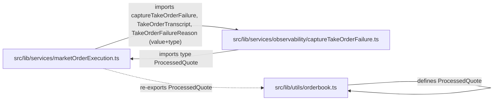

# PR #174 review — simplification pass

Scope: Phase 02 observability surfaces + Phase 01 E2E infra on branch
`phase-01-ui-driven-e2e-tests` vs `main`. All citations are `file:line` against
HEAD `e1a61ea`. Focus: dependency directionality, parallel logic, dead code,
over-engineering. **Not** correctness.

---

## 1. Executive Summary — top 5 simplifications by ROI

| # | Fix | Where | LoC removable | Coupling impact |
|---|---|---|---|---|
| 1 | Break the `marketOrderExecution ↔ captureTakeOrderFailure` import cycle by sourcing `ProcessedQuote` from `$lib/utils/orderbook` (its canonical home). | `src/lib/services/observability/captureTakeOrderFailure.ts:27` | 0 net (1 import edit) | Removes a structural cycle in the services layer DAG. |
| 2 | Extract one shared `classifyError(err)` helper for the three byte-identical (LimitOrder + DcaOrder) and superset (MarketOrder) classifiers. | `LimitOrder.svelte:25-32`, `DcaOrder.svelte:24-31`, `MarketOrder.svelte:847-859` | ~25 | Makes `ErrorClass` taxonomy a single source of truth. |
| 3 | Route the trade-funnel events that currently call `track()` directly through `trackTradeEvent()`. The module's own docstring forbids the raw-`track` pattern. | `MarketOrder.svelte:125,138,161,177,203`, `LimitOrder.svelte:40,49`, `DcaOrder.svelte:38` | ~0 (call-site rewrite) | Restores the "single entry point" contract `tradeEvents.ts:9-12` claims to enforce. |
| 4 | Delete `tests/helpers/previewServer.ts` (74 LoC). Replaced by Playwright's `webServer` block in `playwright.config.ts`; nothing imports it. | `tests/helpers/previewServer.ts` (entire file) | 74 | Dead module. |
| 5 | Delete `withSnapshot()` (anvilControl), the `fundErc20ViaImpersonation` re-export from `fixtures.ts`, and the unused `TRADE_ID_HEADER` export wiring (constant exists but no production caller sends the header). | `anvilControl.ts:42-49`, `fixtures.ts:459`, `tradeId.ts:22` (+ the unreachable `logger.ts:119-124` branch it would feed) | ~30 + unreachable server branch | Removes dead exports + one unreachable validator that masquerades as a security control. |

---

## 2. Dependency Graph Findings

### 2.1 Cycle: `marketOrderExecution` ↔ `captureTakeOrderFailure`



Citations:

- `src/lib/services/marketOrderExecution.ts:47-50` — imports `captureTakeOrderFailure`, `TakeOrderTranscript`, `TakeOrderFailureReason` from `$lib/services/observability/captureTakeOrderFailure`.
- `src/lib/services/observability/captureTakeOrderFailure.ts:27` — `import type { ProcessedQuote } from '$lib/services/marketOrderExecution';`.
- `src/lib/utils/orderbook.ts:73` — canonical `export interface ProcessedQuote`.
- `src/lib/services/marketOrderExecution.ts:16` — re-exports `ProcessedQuote`.

It is a `type`-only import (so it usually erases at compile time), but it is still a structural cycle in the source DAG. Fix:

```diff
- import type { ProcessedQuote } from '$lib/services/marketOrderExecution';
+ import type { ProcessedQuote } from '$lib/utils/orderbook';
```

### 2.2 Layering — clean

`tradeId.ts` and `tradeEvents.ts` only depend on Sentry SDK, `$lib/services/analytics`, and (for `tradeEvents`) `tradeId`. No upward leak. Components / services depending on the obs layer is correct direction. No `routes/` or component imports were found in `src/lib/services/` (verified with grep on imports of `orders/`, `routes/`).

### 2.3 Test-helper directionality — clean (with caveats)

- `tests/helpers/makerOrders.ts` and `tests/integration/ui/syntheticOrdersStub.ts` import only from `@rainlanguage/orderbook` and from type-only modules in `src/lib/api/` — they do not pull production wiring back into tests.
- `eslint.config.js:122-149` (the new no-restricted-imports block) guards `tests/integration/ui/` against `services/marketOrderExecution`, `services/orderDeployment`, `stores/transaction`, `services/walletService`, `types/orderPerspective`. The actual fixture and stub files import only **types** (`ApiOrderSummary`, `ApiOrdersListResponse` from `src/lib/api/st0xApi`), which the rule does not catch — and arguably need not, since type-only imports don't run code in the test. No action.

---

## 3. Parallel Logic Findings

### 3.1 Triplicated `classifyError`

Three near-identical error-classifiers ship in this PR. They map an `unknown` error to `ErrorClass` (the union declared in `tradeEvents.ts:42-53`).

- `src/lib/components/orders/LimitOrder.svelte:25-32` — handles `user_rejected`, `insufficient_balance`, `rpc_error`, `unknown`.
- `src/lib/components/orders/DcaOrder.svelte:24-31` — **byte-for-byte identical** to LimitOrder's version. The comment at `DcaOrder.svelte:23` even labels itself "(mirrors LimitOrder)".
- `src/lib/components/orders/MarketOrder.svelte:847-859` — superset: adds `slippage_exceeded`, `no_liquidity`, `stale_oracle`, `market_closed`.

The `MarketOrder.svelte:844-846` comment justifies inlining with "duplicated once in LimitOrder / DcaOrder; extract to shared module at three call sites." That threshold has been met — and the LimitOrder/DcaOrder versions are literal duplicates.

**Canonical home:** new file `src/lib/services/observability/classifyError.ts`, exporting one `classifyError(err: unknown, scope?: 'market' | 'deploy'): ErrorClass`. Eliminates the comment, the duplication, and the inline-vs-extract debate.

### 3.2 Trade-funnel events split between raw `track()` and `trackTradeEvent()`

`tradeEvents.ts:9-12` (module docstring):
> Anti-pattern: never inline raw `track()` for trade events; always go through `trackTradeEvent`.

But the call sites split events declared in `TradeEventName` (`tradeEvents.ts:28-40`) across both paths:

| Event | Routed via | File:line |
|---|---|---|
| `trade_panel_opened` | raw `track()` | `MarketOrder.svelte:125`, `LimitOrder.svelte:40`, `DcaOrder.svelte:38` |
| `trade_panel_abandoned` | raw `track()` | `MarketOrder.svelte:203`, `LimitOrder.svelte:49` |
| `trade_error_shown` | raw `track()` | `MarketOrder.svelte:138,161,177` |
| `trade_button_clicked`, `quote_received`, `trade_initiated`, `trade_failed`, `limit_order_deployed`, `sign_trade`, `broadcast`, `confirmed` | `trackTradeEvent` | various |

Consequence: events emitted via raw `track()` will **not** carry `trade_id`, breaking the funnel correlation the lifecycle module advertises (`tradeId.ts:5-8`). Either:

- Route all of them through `trackTradeEvent` (simplest — accept the small extra `scrubProps` cost), **or**
- Update the docstring to admit the split and document which events skip `trade_id` enrichment and why.

### 3.3 `broadcast`/`confirmed` emission is "collapsed" in two places

- `src/lib/services/marketOrderExecution.ts:647-658` — emits `broadcast` then `confirmed` back-to-back after the aggregated-take call returns success.
- `src/lib/stores/deployTransactionStore.ts:242-266` — emits `broadcast` after `sendTransaction` returns hash, then `confirmed` immediately after.

Both have long comments explaining the collapse (`marketOrderExecution.ts:640-646`, `deployTransactionStore.ts:255-260`). The justification is the same in both cases ("no per-callback hook to distinguish"). If the boundary is genuinely indistinguishable, it would be honest to either:

- Emit a single `executed` event (rename to keep funnel name stable), **or**
- Drop one of the two — the funnel chart counts the same wallet click twice.

Not load-bearing for this PR, but worth flagging.

### 3.4 PII scrubbing duplicated between `scrub.ts` and `tradeEvents.ts`

- `src/lib/observability/scrub.ts:18-20` — `ADDR_RE`, `SIG_RE`, plus `SIG_QUERY_RE`. Recursive walk over Sentry events.
- `src/lib/services/observability/tradeEvents.ts:73-82` — `ADDR_RE`, `SIG_RE` (no `SIG_QUERY_RE`), scrub `error_message` field only.

`tradeEvents.ts:18-19` openly admits the duplication: "constants are duplicated (not imported) because scrub.ts targets a different SDK boundary."

Acceptable trade-off as written, but two regex constants ("scrub-rules" registry) could live in a shared `src/lib/observability/pii.ts` and be re-exported from both call sites. Then a future "now scrub `0x[64]` tx-hashes too" change happens once, not twice. Low-priority but real.

### 3.5 `RegistryInstance` shape declared twice

- `src/lib/services/orderDeployment.ts:54-71` — `DotrainRegistryInstance` for the browser code path.
- `tests/helpers/makerOrders.ts:135-156` — `RegistryInstance` for the anvil/test maker-order helper.

Both shapes describe the same SDK type imperfectly (the SDK doesn't export it cleanly). Test code intentionally points at anvil instead of the absolute URL the production module computes, so a true shared abstraction would be awkward. **Recommend:** leave for now; consider exporting `DotrainRegistryInstance` from `orderDeployment.ts` and have makerOrders extend/narrow it (not blocking).

---

## 4. Dead Code Findings

### 4.1 `tests/helpers/previewServer.ts` — entire file unused

- `tests/helpers/previewServer.ts:39` `startPreviewServer`, `:66` `stopPreviewServer`, `:18` `waitForUrl` — none of these are imported anywhere outside the file (verified via grep across `tests/` and `playwright.config.ts`).
- `playwright.config.ts:webServer` (lines ~33-49 of that file) now owns preview lifecycle.

**Action:** delete the file (74 LoC).

### 4.2 `withSnapshot` — exported, unused

- `tests/helpers/anvilControl.ts:42-49` — exported, not imported anywhere. Snapshot/revert lifecycle is in-lined in `tests/integration/ui/fixtures.ts:196-202` instead.

**Action:** delete.

### 4.3 `fundErc20ViaImpersonation` re-export from fixtures

- `tests/integration/ui/fixtures.ts:459` re-exports both `fundErc20` and `fundErc20ViaImpersonation`.
- `fundErc20` IS imported by `marketFailures.spec.ts:52`. `fundErc20ViaImpersonation` is NOT imported by any spec — specs use the `fundToken` wrapper (`fixtures.ts:158`) instead.

**Action:** remove `fundErc20ViaImpersonation` from the re-export list (keep the internal import for `fundToken` to use).

### 4.4 `TRADE_ID_HEADER` constant — no production caller; renders `logger.ts` validation unreachable

- `tradeId.ts:22` — `export const TRADE_ID_HEADER = 'X-Trade-Id'`.
- Sole importer: `tests/lib/services/observability/tradeId.test.ts:23`.
- No `fetch()` / `apiClient` / interceptor in `src/` sets the header.
- `src/lib/server/logger.ts:119-124` reads `event.request.headers.get('x-trade-id')` and validates it with a UUIDv4 regex — but since the browser never sends it, the regex always falls through to `null`. The branch is "alive in tests, dead in prod".

**Action:** either (a) wire it — add the header to outbound fetches at a single client-layer seam — or (b) delete the constant, the server-side read, and the `trade_id` field on `RequestContext` (`logger.ts:34`) until a future iteration wires it. As shipped it's a Sentry-correlation feature that doesn't correlate.

### 4.5 Dead code I checked for and did **not** find

- No commented-out blocks in the new obs files.
- No `console.log` left in the obs source — all `console.error` paths are intentional "logging never throws" fallbacks (`tradeEvents.ts:90`, `tradeId.ts:32,46`, `captureTakeOrderFailure.ts:109,124`).
- The `console.log` calls at `marketOrderExecution.ts:534, 614` predate this PR (blame: `ea9f7c7a`, 2026-04-21) — out of scope.
- Skipped specs (`marketFailures.spec.ts:93,140,247`, `limitDeploy.spec.ts:30`, `marketSell.spec.ts:23`, `marketBuy.spec.ts:31`, `marketFailures.spec.ts:65`) are either the documented `marketFailures` skips or the `test.skip(!BASE_RPC_URL, ...)` guards — both intentional.

---

## 5. Over-engineering Findings

### 5.1 `getDotrainRegistry()` defensive double-lookup

`src/lib/services/orderDeployment.ts:37-53`:

```ts
const Registry =
    (orderbookModule as { DotrainRegistry?: unknown }).DotrainRegistry ??
    ( orderbookModule as unknown as { default?: { DotrainRegistry?: unknown } }).default?.DotrainRegistry;
```

The fallback into `.default?.DotrainRegistry` guards against an ESM/CJS interop accident that hasn't been observed. The same package is imported flat by `makerOrders.ts:35` (`import { DotrainRegistry, type OrderV4 } from '@rainlanguage/orderbook'`) without issue. Either the flat import works (and the defensive fallback is unnecessary) or it doesn't (and `makerOrders.ts` is currently relying on luck). Pick one. Simpler fix: drop the runtime double-lookup, use the top-level `import { DotrainRegistry }` pattern.

### 5.2 `RegistryInstance` type cast gymnastics in `makerOrders.ts`

`tests/helpers/makerOrders.ts:157-170`:

```ts
const r = await (DotrainRegistry as unknown as {
    new: (url: string) => Promise<{ error?: { readableMsg: string }; value?: RegistryInstance }>;
}).new(registryUrl);
```

Three `as` casts (`unknown`, then narrowing, then a `value?` envelope) for a single call. The cleaner shape is to declare a single `DotrainRegistryStaticShape` interface once and cast once. Not blocking — test-only file.

### 5.3 Long-form `Date.now()` patch in fixtures.ts

`tests/integration/ui/fixtures.ts:230-249` — patches `Date.now`, the zero-arg `new Date()` constructor, then re-attaches `UTC`, `parse`, `now` to the patched constructor. Verbose, but necessary: production code calls both `Date.now()` and `new Date()` and the patch must be lossless. Three `eslint-disable-next-line @typescript-eslint/no-explicit-any` comments inside the patch are unavoidable side effects of polluting globals.

**Verdict:** load-bearing complexity. The verbosity is justified by the explanation at `fixtures.ts:215-229`. Keep.

### 5.4 `DeployEventContext` interface with one field

`src/lib/services/orderDeployment.ts:33-35`:

```ts
export interface DeployEventContext {
    order_type: 'limit' | 'dca';
}
```

A one-field record passed through three call layers (component → store → service) just to populate one `order_type` property on PostHog events. Defensible because the comment claims "no silent fallback" (`orderDeployment.ts:248`). If the funnel breakdown lives on `order_type` alone, `(orderType: 'limit' | 'dca')` as a positional parameter would carry the same enforcement with less ceremony.

**Recommend:** inline as a positional arg unless a future field is planned for the same record.

### 5.5 `clearTradeId()` ceremony spans 3 paths in LimitOrder

`LimitOrder.svelte:332, 389, 398` plus the `deferredToProceed` flag at `:246, 309, 331`. The "modal-warning defers to proceedWithDeploy" lifecycle is explained at `:243-246` and again at `:307-309, 387-389, 397-398`. The reader has to hold three call paths in their head. Two simpler options:

- Hoist `mintTradeId()` to inside the modal-confirm proceed path, eliminating the deferred-clear branch (one mint, one clear, in the same scope).
- Or push the lifecycle into a `withTradeId(async () => { ... })` wrapper that owns the try/finally, removing every `clearTradeId()` call from component code (one cite per submit). Same shape as `withSnapshot`.

Recommend the wrapper; the same surface is now repeated in MarketOrder (lines 885, 1004), LimitOrder (lines 242, 332, 389, 398), DcaOrder (lines 202, 268). The "remember to clear in finally" rule is repeated as a comment block at every site (`Pitfall 2 (T-2-E)` — five instances).

---

## 6. Per-file recommendations (top 10 impacted)

### `src/lib/services/observability/captureTakeOrderFailure.ts`
- Line 27: change import to `from '$lib/utils/orderbook'`. **Breaks the cycle.**

### `src/lib/services/observability/tradeEvents.ts`
- Lines 73-82: factor `ADDR_RE`/`SIG_RE` into `$lib/observability/pii.ts` and import here + in `scrub.ts`. Cosmetic.

### `src/lib/services/observability/tradeId.ts`
- Line 22: either wire `TRADE_ID_HEADER` into outbound fetches, or delete this constant and the matching server read at `logger.ts:119-124`.
- Consider exporting a `withTradeId<T>(fn: () => Promise<T>)` helper that does mint/try-await/finally-clear. Eliminates all 7 `mintTradeId`/`clearTradeId` call sites.

### `src/lib/server/logger.ts`
- Lines 119-124: if `TRADE_ID_HEADER` is not being sent (see above), delete this block and the `trade_id` field on `RequestContext` (line 34). Keep the rest.

### `src/lib/components/orders/LimitOrder.svelte`
- Lines 25-32: delete `classifyDeployError`, import shared `classifyError` instead.
- Lines 40, 49: route `trade_panel_opened` + `trade_panel_abandoned` via `trackTradeEvent` to inherit `trade_id` enrichment.
- Lines 242-334: collapse the `deferredToProceed`/three-`clearTradeId` lifecycle with the proposed `withTradeId` wrapper.

### `src/lib/components/orders/DcaOrder.svelte`
- Lines 24-31: delete `classifyDeployError`, import shared `classifyError`.
- Line 19: drop the now-unneeded `import { track }`.
- Line 38: route `trade_panel_opened` via `trackTradeEvent`.

### `src/lib/components/orders/MarketOrder.svelte`
- Lines 847-859: replace `classifyMarketError` with the shared `classifyError(err, 'market')`. Delete the comment at 844-846 ("extract to shared module at three call sites" — done).
- Lines 125, 138, 161, 177, 203: route the five raw `track()` calls through `trackTradeEvent` to fix the funnel contract.

### `tests/helpers/previewServer.ts`
- Delete the file. 74 LoC, no callers.

### `tests/helpers/anvilControl.ts`
- Lines 42-49: delete `withSnapshot` — unused.

### `tests/integration/ui/fixtures.ts`
- Line 459: remove `fundErc20ViaImpersonation` from the re-export list. No spec imports it.

---

## 7. What I confirmed is NOT a problem

- The `tests/integration/ui/__fixtures__/goldsky-cache/*.json` files are a legitimate fixture set, not check-in noise (the rationale in `fixtures.ts:39-44` is sound — committed warm cache for CI).
- `forkOrdersStub.ts` and `syntheticOrdersStub.ts` look similar at a glance but are not parallel implementations: `fork` is the Path-A bridge (live orders re-quoted against fork), `synth` is the Path-B bridge (anvil-only maker orders synthesized into Goldsky shape). The two paths cooperate via the maker-orders registry in `fixtures.ts:312-329` (synth runs first if registered, falls through to fork). Correct separation.
- `tests/helpers/makerOrders.ts`'s ad-hoc retry-with-backoff loop at lines 227-250 duplicates the Goldsky 429 retry in `fixtures.ts:356-364` only superficially — they target different fetch boundaries (in-WASM SDK vs Playwright route handler). Acceptable.
- The CSP extraction (`src/lib/server/csp.ts`) cleanly separates a test-targetable surface from the `hooks.server.ts` side effects. The `process.env.E2E` gate at line 25 is correctly scoped per the comment at lines 14-19.
- Sentry Replay config at `hooks.client.ts:32-37` matches the docstring D-02/D-03 claims (sample 0, on-error 1.0, maskAllText/Inputs, blockAllMedia). No drift.

---

## 8. Effort estimate to apply all "must fix" items

- §2.1 cycle: 1 import edit, 30 seconds.
- §3.1 classify-error extraction: ~20 minutes (new file, 3 swap sites, 3 test updates if any).
- §3.2 `trackTradeEvent` routing: ~30 minutes (8 call sites, no test changes since the events already exist in the union).
- §4.1, §4.2, §4.3, §4.4 deletions: ~10 minutes total.

**Total: ~1 hour of mechanical changes** to land all the high-value items in this report.
